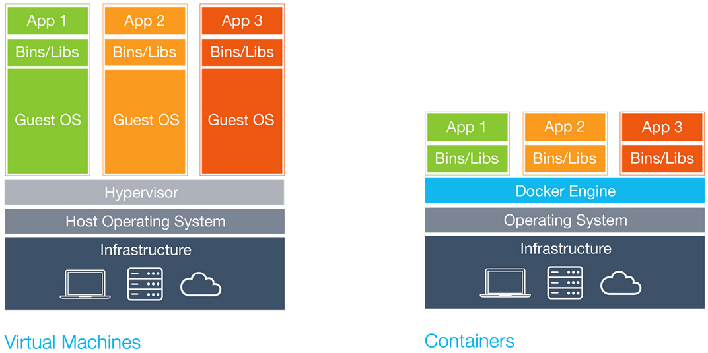
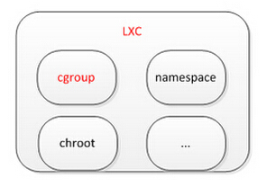
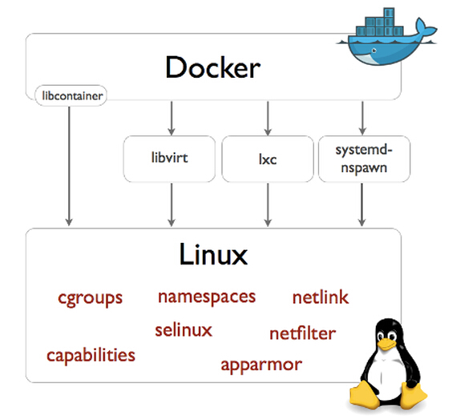
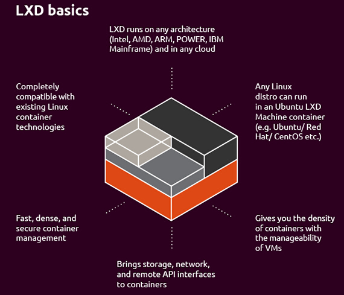

## 虚拟化容器学习入门 ##

**导读：**网络上已经有大量优秀文章，通过不同层面和角度详尽地介绍了虚拟化/容器技术，这里不再赘述，大家可自行搜索、阅读。本篇将简单串联介绍LXC、Docker等基本概念，抛砖引玉，作为大家由浅入深了解和学习Docker的入门篇。希望大家能一起思考和实践容器技术，共同进步。

## 容器是什么？ ##

容器，顾名思义，用来包裹或装载物品的器皿。盛水的杯子是容器，装货物的箱子也是容器。

我们这里所说的容器，是指有效地将代码、系统库、运行环境等操作系统管理的资源划分的孤立组或集合。

容器技术由来已久，如OpenVZ、FreeVPS等，但是这些方案采用自行修改的Linux内核。目前比较火热的容器技术是LXC、Docker。

## 容器 VS 虚拟机 ##

虚拟机是由虚拟工具或者模拟器（HyperV、VMWare等）创建，包含操作系统和虚拟资源，具有较好的隔离性。而容器是在操作系统层面上实现虚拟化，直接复用本地主机的操作系统，可以理解为一个虚拟环境，性能与物理机相近。

  

## 容器技术介绍 ##

### [LXC：Linux容器工具](https://linuxcontainers.org/lxc/introduction/) ###

LXC是基于内核容器属性的用户空间接口，提供一套简化的工具集来创建和管理系统或应用容器。

LXC被认为介于chroot和完全虚拟化之间，其目标为创建一个不需要独立内核，但近可能接近标准Linux安装的环境。在资源管理方面，LXC依赖Linux内核的cgroups子系统，cgroups子系统是Linux内核提供的一个基于进程组的资源管理的框架，可以为特定的进程组限定可以使用的资源；在隔离控制方面，LXC依赖于Linux内核的namespace特性，具体而言就是在clone时加入相应的flag（NEWNS NEWPID等等），提供独立的namespace（网络、pid、ipc、mnt、uts等）。

  

### [Docker：应用程序container](https://www.docker.com/what-docker) ###

Docker是一个开源的容器引擎，让开发者可以打包他们的应用及依赖包到一个可移植的容器中，并发布到主流Linux机器上。

Docker最早是基于LXC技术，是在LXC上进行了封装，将应用程序变成一种标准化的、可移植的、自管理的组件。Docker的哲学是“每个容器运行一个应用进程”，主要用途是应用的打包、转移、部署和运行等环节，LXC容器则更接近于轻量虚拟机。

Docker从0.9开始引入libcontainer替代LXC，libcontainer是一个集成了linux内核中很多特性的独特library，通过直接访问Linux内核中的容器API管理namespaces、cgroups、capabilities及文件系统来进行容器控制，libcontainer和Linux系统的交互如下图。LXC在Docker1.8被deprecated，并在Docker1.10被移除。

 

> [扩展阅读：Docker 0.9: introducing execution drivers and libcontainer](https://blog.docker.com/2014/03/docker-0-9-introducing-execution-drivers-and-libcontainer/)

### [LXD：系统级的container](https://linuxcontainers.org/lxd/) ###

LXD基于LXC，增加了新的特性，是一个基于container的Linux容器虚拟机。

LXD与Docker思路不同，Docker是业务层的应用容器，每个容器运行一个应用进程，LXD是系统级的容器虚拟机，提供比较完整的系统（进程）。LXD的竞争对象是KVM，因此它还包含一个OpenStack Nova组件nova-compute-lxd。

  

> [扩展阅读：Stackoverflow：How is “lxd” different from lxc/docker?](http://stackoverflow.com/questions/30430526/how-is-lxd-different-from-lxc-docker)
