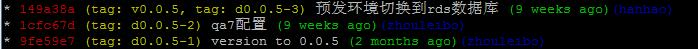
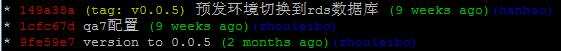
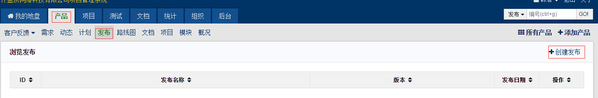

# Git仓库使用和发布流程、规范

## 一、Git仓库、分支、Tag标签的使用。

### 1、Tag使用说明

Tag分为2大类，一类由开发人员打，一类由运维人员打，均打在master分支。如有特殊情况，开发将Tag打在非master分支，必须说明Tag所在分支，并最终需合并到master分支。

**（1）由开发人员打的Tag：准发布Tag**

如d0.0.1-1、d0.0.1-2，d表示dev/deploy，0.0.1表示版本号，-1、-2表示此版本打的第几次Tag（同一版本原则上不超过3次）。

**（2）由运维人员打的Tag：正式Tag**

common、service类项目，如m0.0.1，m表示maven release，0.0.1表示版本号。

产出war包项目，如v0.0.1，v表示version release，0.0.1表示版本号。

**举个栗子：**

正式Tag是对“准发布Tag”的确认，标记已上线的代码节点，如开发打了3次“准发布Tag”：d0.0.5-1、d0.0.5-2、d0.0.5-3，最终上线生产环境的为d0.0.5-3，则运维人员会对d0.0.5-3所指向的代码节点再打一个“正式Tag”：v0.0.5。

运维人员会定期清理“准发布Tag”，“正式Tag”不会删除。比如，当发布0.0.6版本时，会对之前的准发布Tag，如d0.0.5-1、d0.0.5-2、d0.0.5-3，进行清理。

### 2、Git仓库使用规范

（1）各git仓库，只由一个团队A维护，其他团队B可提需求给团队A，或对团队A的分支提交review。

> autoconfig文件在各自仓库中维护，java工程编译打包使用mvn profile来区分各环境配置文件。

（2）各仓库开发请不要直接push到master分支，应push或push review到开发分支，并由项目Owner视需求合并到master分支。

## 二、发布申请流程。

**1、如涉及资源采购，需至少提前2周邮件发送运维。**

机器、证书等项目所需资源，需开发提前发送给运维，并尽可能附上架构图，或和运维一起确认架构；确保采购信息后，由运维发起采购流程，向财务报备，申请资金。

**2、发布申请，需至少提前1天和运维进行预约。**

> 紧急发布须由领导审批，确认其紧急性，并最晚于下班前提供相关PMS发布说明文档，否则，运维拒绝发布。另，节假日前1天不推荐进行上线变更操作。

发布申请邮件请发送至`ops@htrader.cn`，抄送本`项目PD/PM`，和`技术部全员`，如多个项目组发布申请时间冲突，可自行协商解决。运维人员收到发布申请后，会跟进本次发布事项。

**3、填写PMS“产品-发布”记录，发起预发布。**

> PMS发布记录是否要上传“发布文档”，需根据变更复杂度情况，同运维确认必要性，如需编写和上传“发布文档”到PMS，请参考[发布文档参考示例](http://wiki.htrader.cn/Deploy/Deploy)。

开发人员在代码经测试验收后，填写PMS发布记录（发布变更情况，如仓库、Tag、是否上维护页面等），发起预发环境变更，运维人员根据记录进行变更实施，测试人员进行预发环境变更确认和验收。

**4、预发验收完毕，PM/PD发起正式上线流程。**

预发环境验收完毕，PM/PD可发起正式上线流程，如确定正式上线维护时间、停服公告等。如需停服上维护页面（vm模板、静态资源等更新可不停服）。

**5、生产环境变更实施，运维及时反馈通知。**

运维人员在同`发布发起人`约定的维护时间内，进行生产环境变更实施，待上线完毕，运维在PMS中添加相应说明，并邮件回复`发布发起人`，抄送`技术部全员`，告知上线完毕。

## 三、其他建议和说明

1、项目开发过程中建议测试只针对master分支测试，预发前对“准发布Tag”做上线前验证。

2、需release到maven私有库的项目，建议提前执行release操作，应尽量提前于预发布执行。

3、产出war包的项目，开发及时修改pom文件中maven release版本依赖，并检查autoconfig文件（包括pre和online）。

> 各环境信息查询见[公共组件信息]和[pre、online主机信息](http://wiki.htrader.cn/MachineList/OnlineMachineList)。
