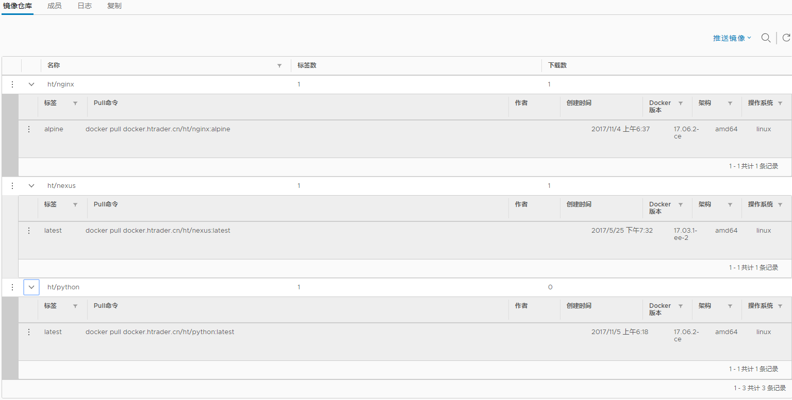

# Docker Harbor使用说明

> 私有Docker Harbor使用说明不提供mirror官方源，仅作内部docker仓库使用。

------

## 一、使用国内Harbor mirror源

这里使用网易的Harbor mirror源，启动docker时添加参数`--registry-mirror=http://hub-mirror.c.163.com`即可。

    diff /usr/lib/systemd/system/docker.service
    - ExecStart=/usr/bin/dockerd
    + ExecStart=/usr/bin/dockerd  --registry-mirror=http://hub-mirror.c.163.com

## 二、使用私有Docker Harbor

私有Docker Harbor仓库提供镜像信息查看的[web页面](https://docker.htrader.cn)。

**使用示例：**

上传镜像时候建议使用“仓库名/包名:版本”的形式，如 ht/centos:7。
	
	# docker login -uusername			#登录hub.docker.com
	Password: 
	Login Succeeded
	
    # docker pull python                      # 从官方源获取python镜像，不指定版本默认获取latest
    Using default tag: latest
	latest: Pulling from library/python
	85b1f47fba49: Pull complete 
	ba6bd283713a: Pull complete 
	817c8cd48a09: Pull complete 
	47cc0ed96dc3: Pull complete 
	4a36819a59dc: Pull complete 
	db9a0221399f: Pull complete 
	7a511a7689b6: Pull complete 
	1223757f6914: Pull complete 
	Digest: sha256:bd54e27f94bfbe86ffe42690bcce8f33f4972902b529943e71a3226d28e8953a
	Status: Downloaded newer image for python:latest

    # docker images                           # 查看获取到的python镜像信息
    REPOSITORY                   TAG                 IMAGE ID            CREATED             SIZE
	python                       latest              79e1dc9af1c1        11 days ago         691MB

    # docker tag python docker.htrader.cn/ht/python  # 设置镜像别名
	# docker images
    REPOSITORY                    TAG                 IMAGE ID            CREATED             SIZE
	docker.htrader.cn/ht/python   latest              79e1dc9af1c1        11 days ago         691MB
	python                        latest              79e1dc9af1c1        11 days ago         691MB
	
	# docker login -uguojx docker.htrader.cn		# 登录本地Docker仓库
	Password: 
	Login Succeeded

    # docker push docker.htrader.cn/ht/python             # 推送到私有库
	The push refers to a repository [docker.htrader.cn/ht/python]
	4674279fa6bb: Pushed 
	21373cf20030: Pushed 
	eff11cc62052: Pushed 
	1b34d79f9112: Pushed 
	63866df00998: Pushed 
	2f9128310b77: Pushed 
	d9a5f9b8d5c2: Pushed 
	c01c63c6823d: Pushed 
	latest: digest: sha256:4429d74a125ab7e6c9b14f06459f66007ce5b5c44b89b02553ccd93f30b12f5e size: 2007

    # docker rmi docker.htrader.cn/ht/python:latest               # 删除本地镜像
    # docker pull docker.htrader.cn/ht/python:latest              # 从私有库获取镜像

可通过web页面查看仓库、镜像信息。

  
