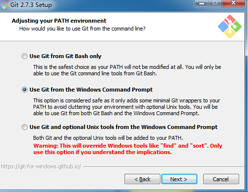
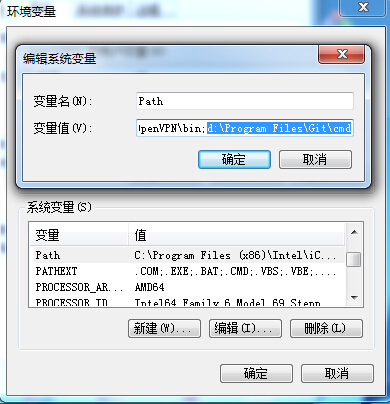
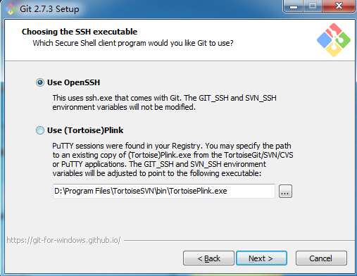
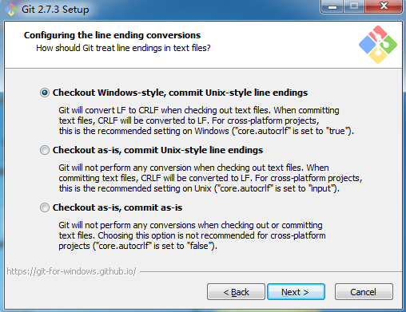
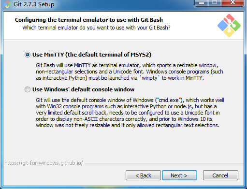
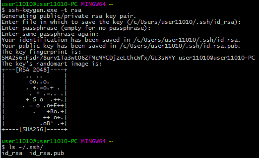
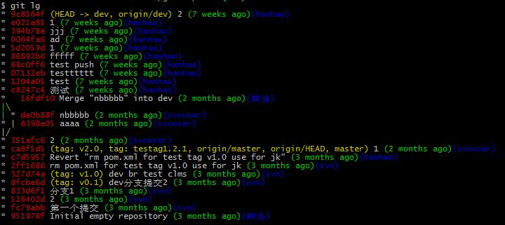

# Git客户端使用详解

> Git最为基本的是`命令行`操作，因此本文将以`命令行`操作为基础示例。
> 文档主要受众为Windows用户。

## 安装Git

### 1、获取安装包

Git官方最新Release版本为[Git-For-Win-64-bit](https://git-scm.com/download/win)。

### 2、安装过程

这里只给出主要的几个步骤，其他一直“Next”即可。

选择“Use Git from the Windows Command Prompt”将会自动设置PATH系统环境变量，如下图。如果PATH中没自动设置，可自行添加。

通常选择OpenSSH。

安装完毕，可以分别打开`Windows命令提示符(cmd)`和`Git Bash`，输入`git`命令验证是否正确安装。

## 命令行操作

命令行推荐使用`Git Bash`。

### 1、配置ssh

配置ssh key，用于git ssh协议的认证，可在`Git Bash`中输入`ssh-keygen -t rsa`生成。其中`id_rsa`为私钥，请妥善保管，`id_rsa.pub`为公钥。

### 2、设置git全局配置

git全局配置为当前用户所有git仓库公用，故通用配置常用不变项。

    $ git config --global user.name wangxy                             ## 设置用户名
    $ git config --global user.email wangxy@htrader.cn               ## 设置用户邮箱
    $ git config --global color.ui auto                                ## 设置色彩
    $ git config --global pull.rebase true                             ## 变基！务必加上这条！！！
    $ git config --global remote.review.push refs/heads/*:refs/for/*   ## 用于push到gerrit review，与后面git仓库配置结合使用

配置完毕可在git全局配置文件`~/.gitconfig`中查看设置完成的条目。

    $ cat ~/.gitconfig
    [user]
        name =wangxy
        email = wangxy@htrader.cn
    [color]
        ui = auto
    [pull]
        rebase = true
    [remote "review"]
        push = refs/heads/*:refs/for/*

也可以在`~/.gitconfig`中增加alias来简化命令操作，如使用`git lg`。

    [alias]
        co = checkout
        st = status
        di = diff
        ci = commit
        br = branch
        cp = cherry-pick
        lg = log --graph --pretty=format:'%Cred%h%Creset%C(yellow)%d%Creset %s %Cgreen(%cr)%Creset%Cblue(%an)%Creset' --abbrev-commit --date=relative

### 3、设置git仓库配置

我们clone一个仓库，查看它的`git仓库配置文件`如下，文件的路径是{ProjectDir}/.git/config。

    $ git clone ssh://wangxy@gitlab.htrader.cn:22222/Dev/test
    $ cat test/.git/config
    [core]
        repositoryformatversion = 0
        filemode = false
        bare = false
        logallrefupdates = true
        symlinks = false
        ignorecase = true
        hideDotFiles = dotGitOnly
    [remote "origin"]
        url = ssh://wangxy@gitlab.htrader.cn:22222/Dev/test
        fetch = +refs/heads/*:refs/remotes/origin/*
    [branch "master"]
        remote = origin
        merge = refs/heads/master

`git仓库配置`为当前仓库生效，可结合`git全局配置`使用。

### 4、获取远程分支

git clone获取的分支，默认为master分支，master分支一般只有仓库Owner有push权限。

    $ git branch  -vv
    * master ca6f5d5 [origin/master] 1        ## 依次是：分支名 commitID [跟踪的远程分支] commit信息

我们要获取远程非master分支的代码，可先通过`git branch  --list -a`查看所有分支情况，这里发现远程仓库除了mastr分支，还有dev分支。

    $ git branch  --list -a
    * master                                  ## 本地master分支
    remotes/origin/HEAD -> origin/master
    remotes/origin/dev                        ## 远程dev分支
    remotes/origin/master                     ## 远程master分支

建立本地dev分支，并让本地dev分支，跟踪远程dev分支。

    $ git checkout -b dev origin/dev
    Branch dev set up to track remote branch dev from origin.
    Switched to a new branch 'dev'
    $ git branch  --list -a
    * dev                                     ## 前面的*表示当前所在本地dev分支上
      master
      remotes/origin/HEAD -> origin/master
      remotes/origin/dev
      remotes/origin/master
    $ git branch  -vv
    * dev    9c8564f [origin/dev] 2           ##本地dev分支跟踪远程dev分支
      master ca6f5d5 [origin/master] 1
