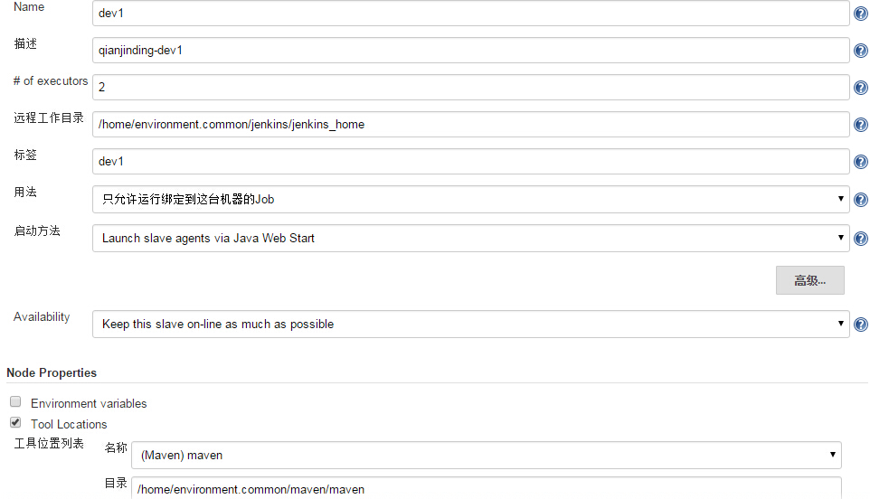
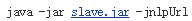

# 增加Jenkins Slave节点

一、web界面增加节点

登录Jenkins平台，选择`系统管理-->管理节点-->新建节点`，填写节点信息。

得到如下信息：

    Run from slave command line:
    java -jar slave.jar -jnlpUrl http://10.1.1.xx:xxxx/computer/dev1/slave-agent.jnlp -secret 2323kkj23b23k9wew8eh32297dwde2i39djwje989

二、设置maven

略

三、服务器设置节点

    $ sudo mkdir /home/environment.common/jenkins/{jenkins,jenkins_home} -p
    $ sudo chown qianjinding.qianjinding /home/environment.common/jenkins/ -R  ## 这里部署账号为qianjinding
    $ sudo -iu qianjinding

下载slave.jar：

    $ cd /home/environment.common/jenkins/jenkins/
    $ wget http://10.1.1.xx/jnlpJars/slave.jar

URI可在web界面上`slave.jar`上右键`复制链接地址`获取。

编辑启动脚本：

    $ vi /home/environment.common/jenkins/jenkins/slave.sh
    java -Dhudson.util.ProcessTree.disable=true -jar slave.jar -jnlpUrl http://10.1.1.xx:xxxx/computer/dev1/slave-agent.jnlp -secret 2323kkj23b23k9wew8eh32297dwde2i39djwje989 &

注意增加了`-Dhudson.util.ProcessTree.disable=true`参数和`&`。

如果需要修改jenkins构建过程中git的超时时间,可以在脚本中加上 `-Dorg.jenkinsci.plugins.gitclient.Git.timeOut=60`，其中60代表60分钟。

下载jenkins依赖的shell脚本，这里使用了http协议：

> [新Jenkins平台脚本使用说明文档](http://wiki.htrader.cn/Jenkins/NewJenkinsShell)

    $ cd /home/environment.common/jenkins/
    $ git clone http://user@gitlab.htrader.cn/jenkins shell

四、启动Slave节点，并设置自启动

    $ sh /home/environment.common/jenkins/jenkins/slave.sh
    $ crontab -e;crontab -l
    @reboot /home/environment.common/jenkins/jenkins/slave.sh > /dev/null 2>&1
