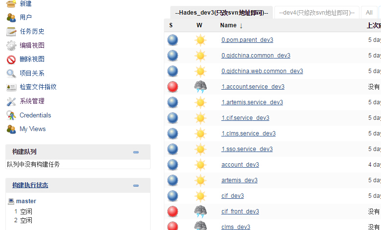
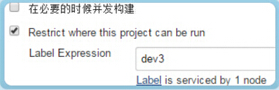
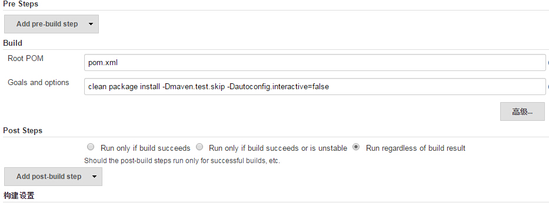
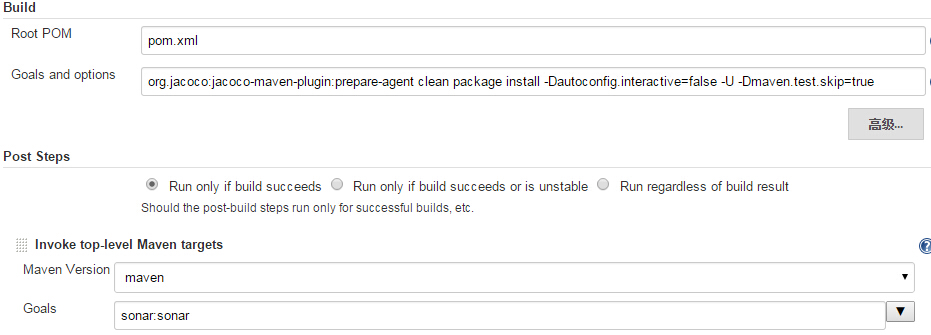

# Jenkins平台操作指南

## 视图和命名规则

为查看方便，通常会对`工程`进行分类`视图`，如使用`dev3`节点，则可新建视图`--dev3(只改svn地址即可)--`，并新建属于`dev3`的工程。为了高效的使用Jenkins，建立视图后，请各项目组使用此**唯一**视图（不要建立多个），同样，工程每个服务也**仅**建立对应的一个。

**规定命名规则如下：**

**(1) 视图：**`--环境名--`，如`--dev3(只改svn地址即可)--`；若要体现对应的项目，可**修改为**`--项目名_环境名--`，如`--Hades_dev3(只改svn地址即可)--`。

**(2) 工程：**`服务名_环境名`或`环境名_服务名`，如`cif_dev3`或`dev3_cif`；要体现对应的项目，可**修改增加**项目名，然后在项目变更时，**只更改svn地址**即可。

  

## 一、构建时，选择唯一节点（环境）

每个节点只允许运行绑定到这台机器的job。如果一个项目团队认领了`dev3`节点，任务需在`Slave（dev3）节点`构建、部署，则如下图设置。其他节点（环境）同理。

  

> 注意：master节点为大家公用，**只用于**构建公共组件的nginx static静态资源。

## 二、构建maven项目

**1. maven项目仅需要`install`到本地。配置示例如下：**

  

若maven项目构建时需包含`测试构建过程`，与`sonar`的集成，参考如下设置。需要注意的是，如果关注**测试覆盖率**，一定要设置org.jacoco:jacoco-maven-plugin:prepare-agent clean package install -Dautoconfig.interactive=false **-Dmaven.test.skip=false** -U。且根据实际需求选择`Post Steps`运行条件。

  

通常集成sonar，如上使用sonar:sonar即可，由于[版本兼容性问题](http://stackoverflow.com/questions/40300653/failed-to-execute-goal-org-sonarsource-scanner-mavensonar-maven-plugin-3-2son)，可指定版本**org.codehaus.mojo:sonar-maven-plugin:3.0.2:sonar**。

**2. 构建前后有`Pre Steps`和`Post Steps`的项目。**

（1）在`Pre Steps`步骤，通过脚本先获取`autoconfig配置文件`，这里以svn仓库获取为例。**注意**从**git仓库获取文件的脚本调用不同于svn**，请**务必**阅读[Jenkins平台脚本使用说明文档](http://wiki.htrader.cn/Jenkins/NewJenkinsShell)。

（2）在`Post Steps`步骤，调用脚本（不是使用部署插件），自动部署服务。

## 其他

1、jenkins master节点启动加载环境变量

    $ grep JENKINS_HOME /etc/sysconfig/jenkins
    JENKINS_HOME="/home/environment.common/jenkins/jenkins_home"

2、ProcessTree参数，防止jenkins启动tomcat服务失败

Master节点：

    $ grep ProcessTree /etc/sysconfig/jenkins
    JENKINS_JAVA_OPTIONS="-Dhudson.util.ProcessTree.disable=true"

Slave节点：

    $ cat slave.sh    ## 启动脚本，加了 -Dhudson.util.ProcessTree.disable=true 参数
    java -Dhudson.util.ProcessTree.disable=true -jar slave.jar -jnlpUrl http://IP:PORT/jenkins/computer/test-node/slave-agent.jnlp -secret XXXXXX  &

3、DNSMultiCast参数，禁止DNS多播特性，防止错误信息撑满log文件

    $ grep DNSMultiCast /etc/sysconfig/jenkins
    JENKINS_JAVA_OPTIONS="-Dhudson.DNSMultiCast.disabled=true"
