# 企业邮箱迁移纪要

> 本文记录腾讯企业邮箱（收费版）迁移至阿里云企业邮箱（免费版）的过程和遇到的问题及解决方法。

## 迁移前调研

阿里云企业邮箱免费版和收费版可使用的账号个数、容量有所不同，并且在功能上存在以下差异：

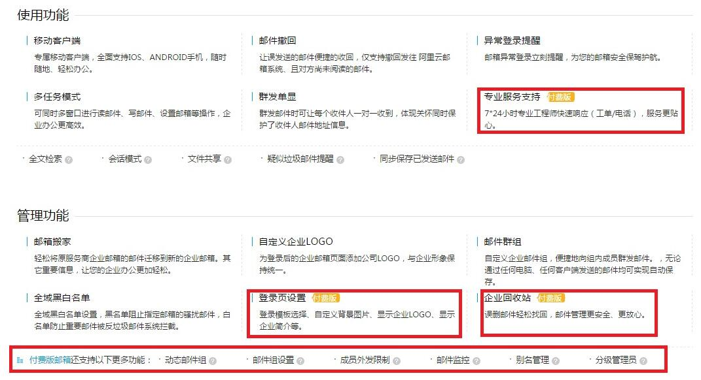

如选用免费版，有2种类型供选择：**按邮箱账号个数**和**按总的邮箱存储量**。我们使用了后者。

> 刚刚（2016.3.21）查看官网，已不见了按存储量免费版本。

需要注意的是，一旦选定类型，则只能升级为相同类型收费版，如企业邮箱（按存储量）免费版只能升级为（按存储量）收费版，无法升级到（按账号个数）收费版。

## 迁移过程

邮箱迁移主要分为3步。

一、邮箱账号迁移。

将腾讯企业邮箱中的账号批量导出。

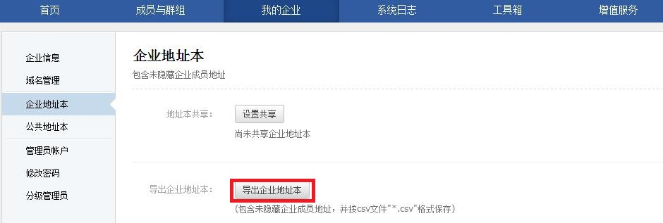

根据阿里云企业邮箱的要求，修改特定条目，并导入。

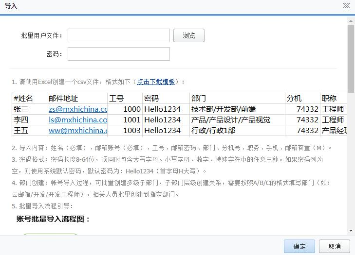

二、历史邮件搬家。

开启邮箱搬家功能的操作见[官方帮助文档](http://mailhelp.mxhichina.com/smartmail/admin/detail.vm?spm=0.0.0.0.jmCR3t&knoId=5865003)。开启之后，各邮箱账号还需要进行单独设置。

1、访问https://qiye.aliyun.com/使用仟金顶邮箱地址（同原腾讯企业邮箱地址）登录，初始密码为Hello1234。

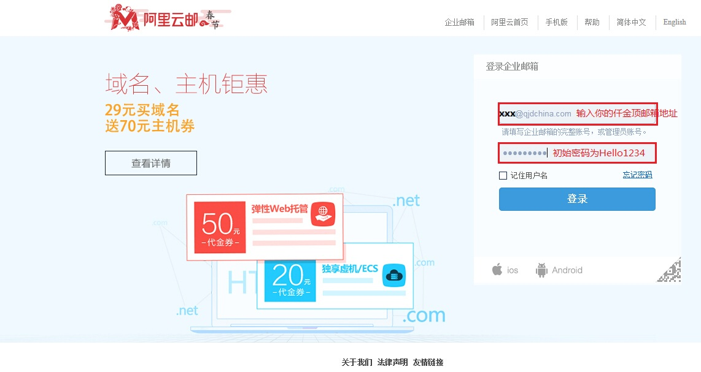

2、修改登录密码，旧密码填写Hello1234，新密码有大小写英文字母和数字组成。注意，这里设置的密码为阿里云企业邮的密码。

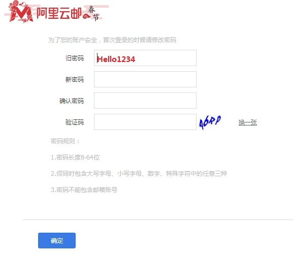

3、填写，并确认安全提示问题。

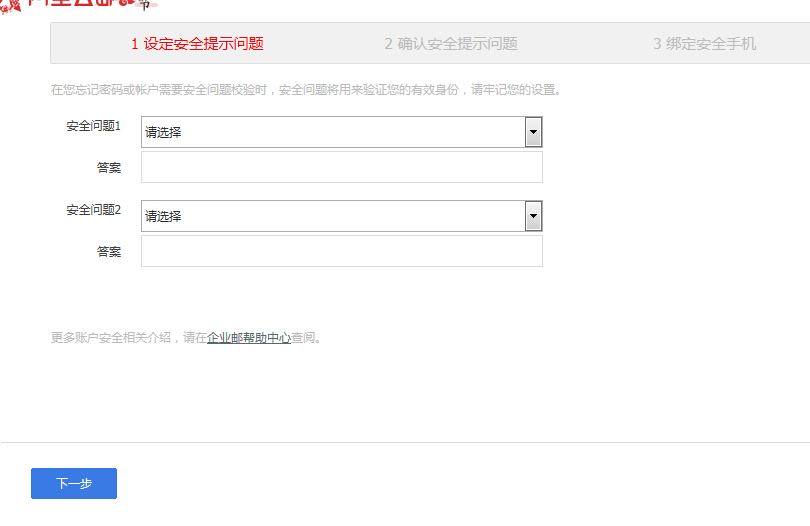

4、绑定手机号。也可以先选择“跳过此步骤”，以后在“账户安全”中设置。

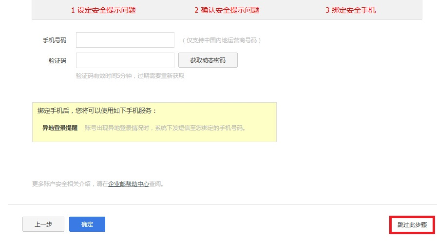

5、进入邮箱后，会提示“是否立即开启账号搬家”，一直选择“确认”。

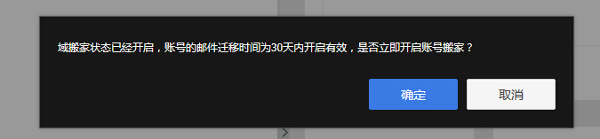

6、如果上一步选择了“取消”，也可以在界面右上角点击（邮箱设置），找到“邮件搬家”选项，填写仟金顶邮箱地址账号，和原腾讯企业邮箱密码，设置搬家来源邮箱。

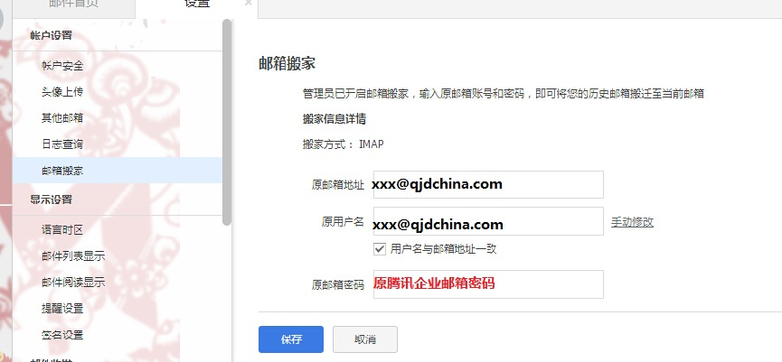

7、设置成功后会显示“邮箱搬家”的一个大致进度。

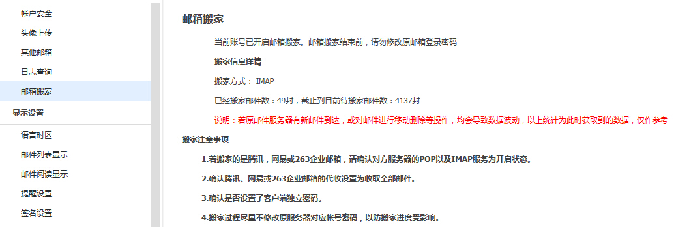

管理员在后台界面也可以查看相应域或账号的搬家进度。

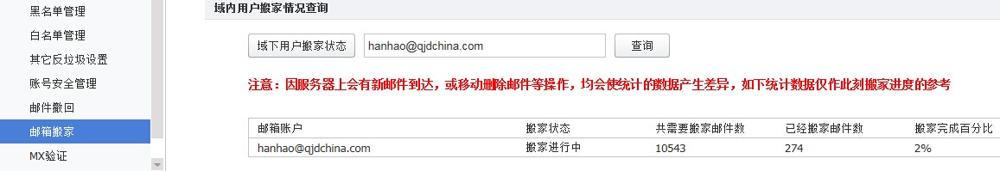

邮箱搬家由于种种原因，速度较慢，我们搬家用时2周。在搬家的过程中，“搬家状态”小概率出现状态异常，已经反馈给阿里云邮箱的同学解决。

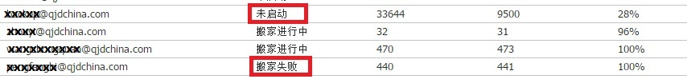

8、查看搬家到阿里云邮箱的历史信件。

历史信件在“其他文件夹”下“邮箱同名文件夹”内。这里有一处交互需要优化，点击“邮箱同名文件夹”，子目录不会展开，必须点击才能展开。

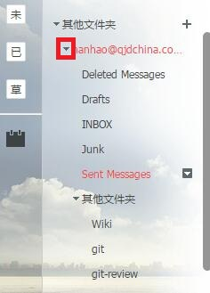

三、域名解析更改。

邮件搬家完毕后，需要**将域名解析指向阿里云企业邮箱**。设置方法可以查看官方帮助文档：[万网域名](http://mailhelp.mxhichina.com/smartmail/detail.vm?spm=0.0.0.0.tQvRdc&knoId=13050276)或[非万网域名](http://mailhelp.mxhichina.com/smartmail/detail.vm?spm=0.0.0.0.jdSxGh&knoId=13050299)设置解析。

在邮箱搬家的过程中，域名解析仍指向腾讯企业邮箱，因此，并不影响原有邮箱收发信件。但阿里云邮箱域名在一定时间未解析的情况下会将邮箱自动删除。技术支持的同学给出了相应办法，需将域名切来切去，不太友好。

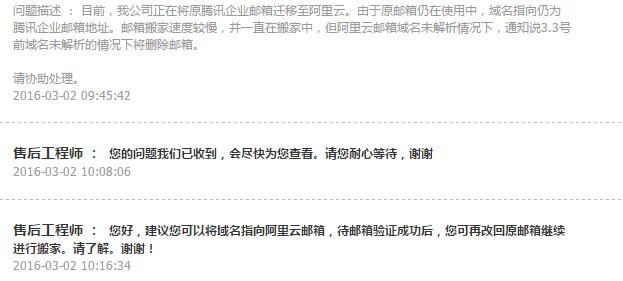

## 邮箱迁移后遇到的问题

主要遇到2个问题。

1、“未读邮件”显示异常。

实际未读邮件为0，但左侧栏会显示有N封未读信件，会误导用户，急死强迫症患者。已反馈阿里云邮箱的同学优化。

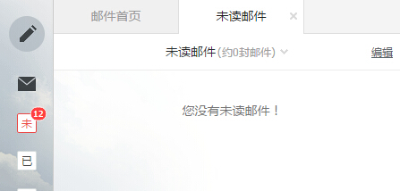

2、腾讯企业邮箱内部域名劫持。

在域名指向到阿里云邮箱后，发现和除腾讯企业邮箱以外的任何邮箱能正常发送信件，但与腾讯企业邮箱收发信件出现异常：

* 通过原腾讯企业邮箱仍然可以正常发信，若收发信的邮箱都是腾讯企业邮箱，则也能正常收信。

* 迁移后的阿里云邮箱地址发信到腾讯企业邮箱被退信，错误提示“550 Sender frequency limited”。

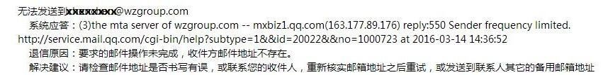

经排查分析，怀疑腾讯企业邮箱使用了内部的域名解析。联系到腾讯企业邮箱客服，对方解答，需将腾讯企业邮箱中对应的域名注销，注销的同时，相应邮件账号和历史邮件也会一并丢失。为避免历史邮件搬家过程中遗漏信件，我们需要将原腾讯企业邮箱中的历史邮件保留数月，故无法接受这个方案。在要求客服人员联系工程师将内部劫持的域名记录删除的同时（沟通需要等待)，我们发送邮件已经出现问题，急需解决。

腾讯企业邮箱下我们使用了2个域名，现迁移掉1个域名，因此我想是否可以将迁移掉的域下账号和历史邮件导给留下的域名？发现可以设置“域别名”，于是我打算试一试。

设置如下，这里有个选项，可以**将某域结尾的账号设置为主显账号**。

设置完毕后，可以看到不同域下成员数量发生了变化。通过“成员与群组”确认账号、对应的主显域名、邮箱使用量都正常，方法可行。

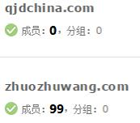

以上，再将迁移掉的域名“注销”即可。保险起见，和腾讯企业邮箱客服人员再三确认后进行了注销操作。

注销后，迁移到阿里云企业邮箱的域账号收发信件均正常，且腾讯原企业邮箱账号和历史邮件保留在新域下，用户可通过新域登录并查看历史信件。这个方法，同样适用于腾讯企业邮箱域名更换。
