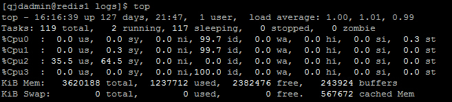
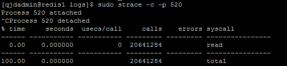
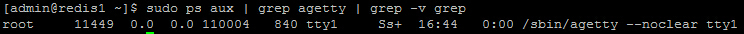
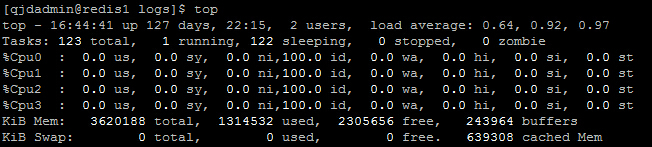
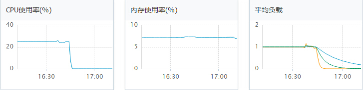

# CPU sys% 过高排查处理

## 问题现象

机器 CPU2 sys% 为 64.5%，系统调用高。

> sys CPU 时间是指 CPU 在内核模式(调用系统函数)所花费的时间。
> [Linux System Call](http://docs.cs.up.ac.za/programming/asm/derick_tut/syscalls.html)

  

## 排查处理

(1)查找 CPU 占用较高的进程。其中，agetty 用于打开一个 tty 端口，提示登录名并调用 /bin/login 命令。

  

(2)查看进程系统调用情况，可以看到 sys_read 调用了 20641284 次。

  

(3)`kill 520`，然后查看新进程信息。

  

(4)查看系统资源，已经恢复正常。

  

## 图表信息 

  
