# 常用 SSH 客户端的设置和使用

## 常见的客户端

1.Windows

Windows 用户可以使用 `PuTTY`、 `XShell (XManager)` 或者 `SecureCRT`。

`PuTTY`是免费软件，[官方站点](http://www.chiark.greenend.org.uk/~sgtatham/putty/download.html)。`XManager`是收费软件，免费可以使用的组件有 [XShell](http://www.netsarang.com/download/free_license.html) 和 [Xftp](http://www.netsarang.com/download/free_license.html), 这两个组件已经可以满足大多数的需求了。`SecureCRT`是收费软件，提供 30 天的试用期，[官方站点](http://www.vandyke.com/products/securecrt/)。**建议** Windows 用户尽量使用 PuTTY 和 XShell (XManager)。

 > 注意: SecureCRT 里生成的公钥/私钥对事实上总共有三个文件，一个公钥文件、一个私钥文件和一个用于加载私钥文件的公钥文件。由于 SecreCRT 不支持 AES-128-CBC 这个 Cipher，而 Linux 下用 ssh-keygen 生成的公钥默认采用这个 Cipher 的，于是对应的私钥可能会加载不了。

2.Linux

 用终端里自带的 ssh 命令即可。

3.Mac OS

 在终端里用 ssh 命令，或者使用 [iTerm2](http://www.iterm2.com/#/section/home)。

## 常见客户端的使用

### 生成公钥/私钥对

1.PuTTY

PuTTY 通常有以下常用工具：

> puttygen.exe: PuTTY 公钥生成工具
>
> pageant.exe: SSH Key Agent
>
> putty.exe: SSH GUI 客户端
>
> pscp.exe: SCP 客户端
>
> psftp.exe: SFTP 客户端
>
> plink.exe: SSH 命令行客户端

运行 `puttygen.exe`生成密钥key。打开 `PuTTY Key Generator`：

  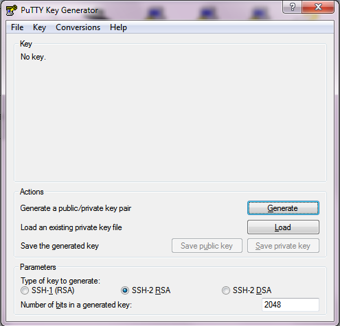

默认的公钥类型和长度是 `SSH-2 RSA` 和 2048 位，可设置 4096 位，选择 `Generate`，并在进度条下方适当地移动鼠标。

  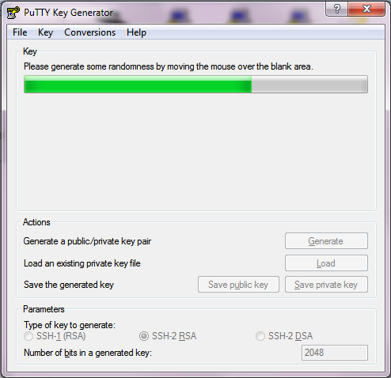

生成完毕后，修改公钥的注释/名称，添加并牢记private key密码。

  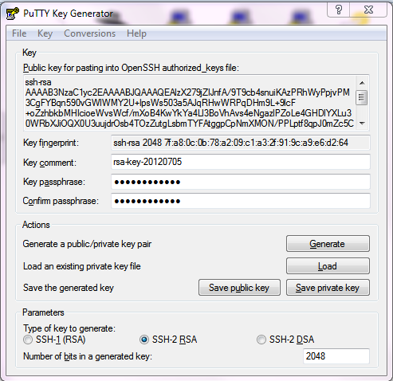

分别选择 `Save public key` 和 `Save private key` 保存公钥和私钥。请注意私钥的保密，公钥分发给需要登录的主机或复制给机器管理员。

2.XShell

启动 XShell 客户端，启动的时候会弹出 Sessions 对话框，点击关闭。选择`Tools菜单 --> User Key Generation Wizard...`。

  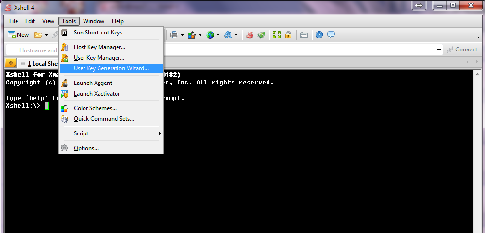

选择要生成的公钥的类型和长度，使用 4096 位 RSA。

> 注意: 非 1024 位的 DSA 公钥可能不被服务器支持。

  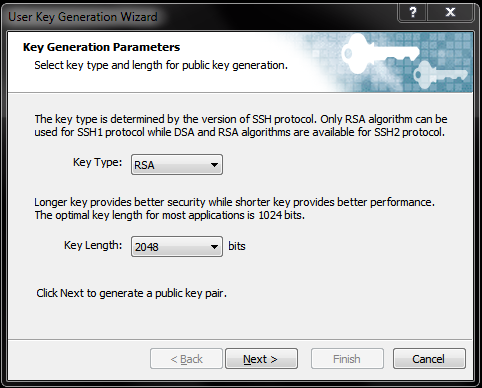

选择 `Next`，等待生成完毕后选择 `Next` 进入`User Key Information` 页面。修改 `Key Name` 并且添加公钥的 `Passphrase`。

  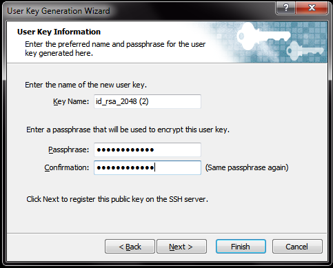

选择 `Next` ，选择 `Save as a file...` 将公钥保存到硬盘上后，可分发给需要登录的主机或复制给机器管理员。

  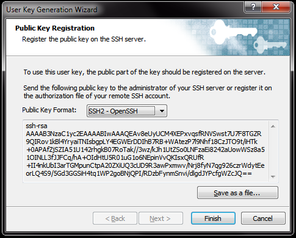

选择 `Finish`，公钥生成完毕后，私钥已经自动加到 XShell 的 Key Manager 里了，请自行查看，并注意私钥的保管。

### 客户端设置

>
> 假设账号为 `admin`，主机名为`mon7.photo.163.org` ，登录端口为`1046`。请根据自己的实际情况修改账号和登陆的服务器。
>

1.PuTTY

运行 `PuTTY.exe` 打开 `PuTTY Configuration`。

  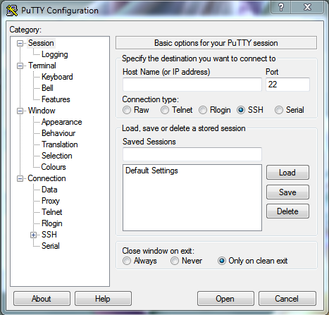

在 `Host Name(or IP address)` 和 `Port` 框分别填入服务器地址和端口。

  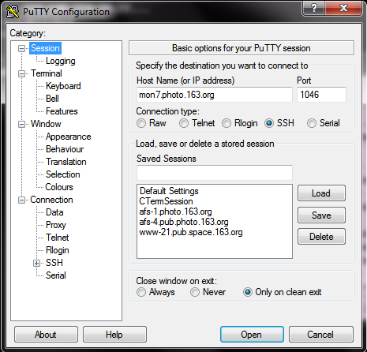

在 `Windows` 下 `Translation` 页选择跟服务器对应的编码。

  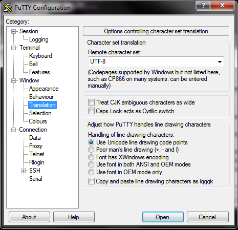

在 `Connection` 下 `Data` 页 `Auto-login username` 框输入登陆所用的用户名。

  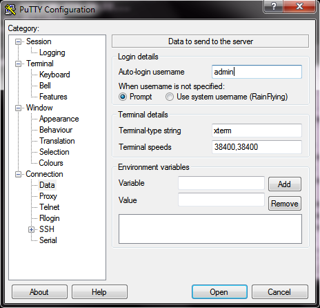

展开 `Connection` 页面，选择 `Auth` 页，选择 `Private key file for authentication` 框后的 `Browse...` 加载私钥。

  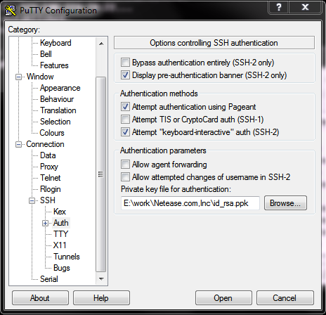

回到最开始的 `Session` 页，在 `Saved Sessions` 下的框中输入会话的名称，并选择右下侧的 `Save` 保存会话。

  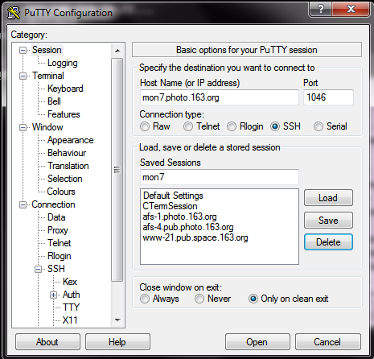

最后，选择对应的会话，点击`Open`或直接双击会话即可登录机器。

2.XShell

>
> 假设账号为 `admin`，主机名为`mon7.pub.photo.163.org` ，登录端口为`22`。请根据自己的实际情况修改账号和登陆的服务器。
>

打开 XShell，在 `Sessions` 对话框中选择 `New` 打开 `New Session Properties`。

  

在 `Connection` 页的 `Name`、`Host` 和 `Port` 框分别填入会话的名称和服务器的地址。

  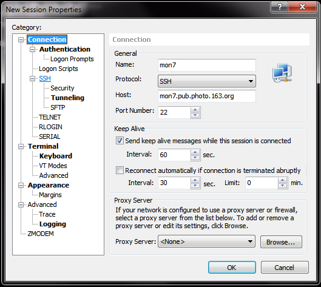

在 `Connection` 下 `Authentication` 页选择验证方式，填写 `User Name`，选择公钥，并输入之前设置的 Passphrase。

  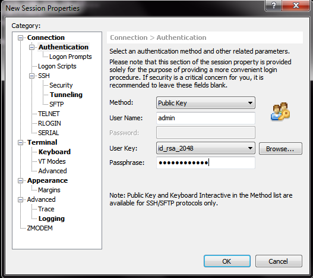

在 `Connection` 下 `Terminal` 页的 `Encoding` 框选择跟服务器上设置对应的编码。

  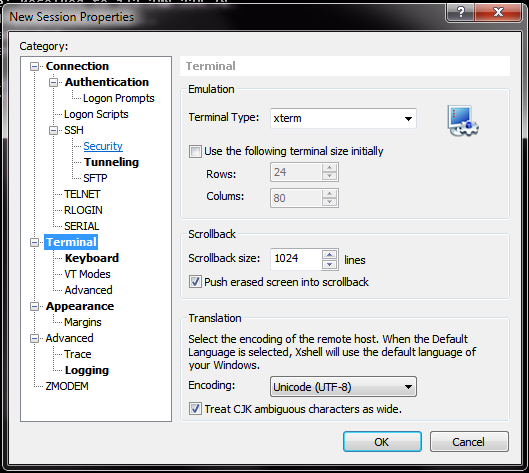

选择 `OK` 保存会话，之后选择对应的会话登录即可。

### SSH Agent Forward 的设置

> 只需要登录单台主机，无须设置 SSH Agent Forward。若通过跳板登录多台主机可设置，并在每次登录后确认自己所登录的机器，以免误操作。

1.PuTTY

方法一:

该方法需要每次手动启动 `Pageant.exe` 并且每次需要手动加载一次私钥。

运行安装目录下的 `pageant.exe` 打开 `Pageant Key List` 窗口。

  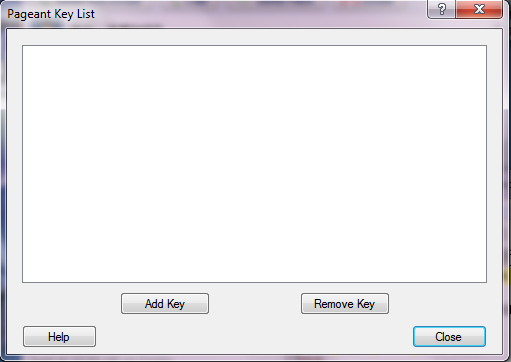

选择 `Add Key` 将私钥加载到 `Pageant` 里，加载的时候会提示生成公钥/私钥对时设置的 passphrase。

  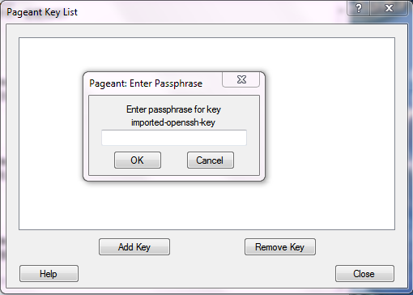

加载完成后在 `Pageant Key List` 的框中会列出私钥的类型、长度和 fingerprint 等信息，点击 `Close` 关闭窗口即可。

  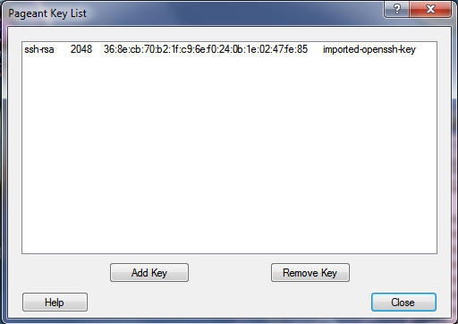

运行安装目录下的 `putty.exe` 打开 `PuTTY Configuration`，选择想要开启 SSH Key Agent 的会话，然后选择对应会话右侧的 `Load`。

  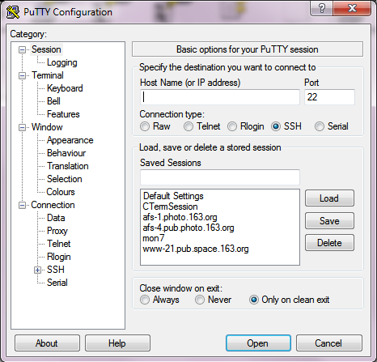

在 `Load` 完成之后，展开左边 `Connection` 下的 `SSH` 页，选择 `Auth` 页，勾选 `Allow agent forwardwing`。

  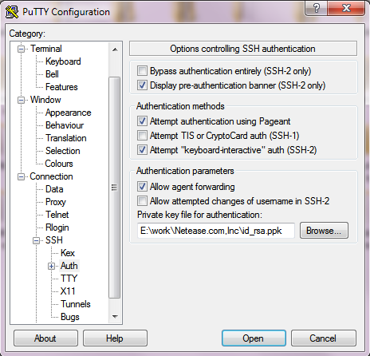

回到刚打开 `PuTTY Configuration` 时所在的 `Session` 页，选择会话列表右侧的 `Save` 保存刚才所做的修改。

  

之后在 ssh 登陆之前先运行 `pageant.exe` 重复以上步骤。

方法二：

右键选择安装目录下的 `pageant.exe` 文件创建一个快捷方式。

选择刚创建的快捷方式，右键打开`属性`对话框。

  

在 `Target/目标` 框内 **追加** 私钥文件的位置。

  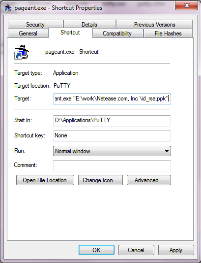

选择 `OK` 保存刚才所做的修改。之后在启动 `putty.exe` 之前先双击执行刚才创建的快捷方式即可。

2.XShell

打开想要开启 SSH Agent Forward 的会话的 Properties 对话框。选择 `Connection` 下的 `SSH` 页，勾选 `Use Xagent (SSH Agent) for passphrase handling` 和 `Launch Xagent automatically` 前的两个复选框。

  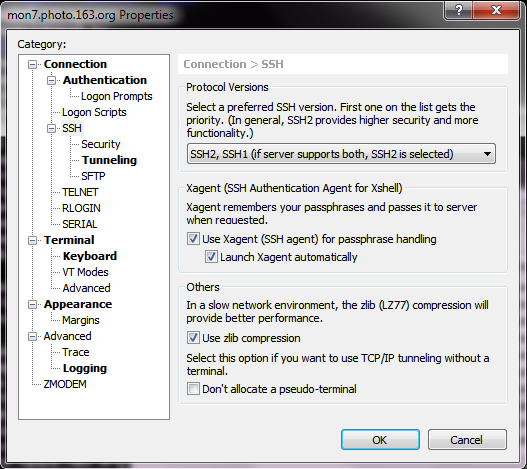

选择 `OK` 保存设置。之后登录会话即可。
