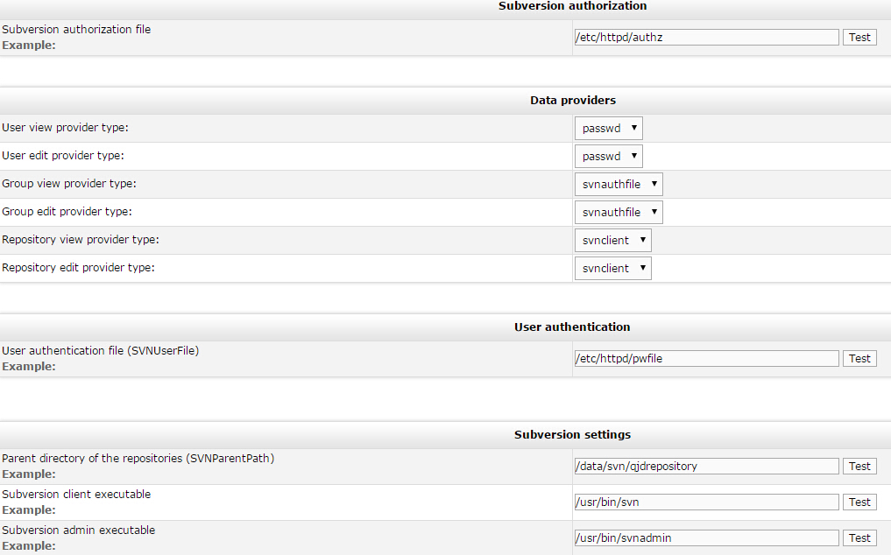
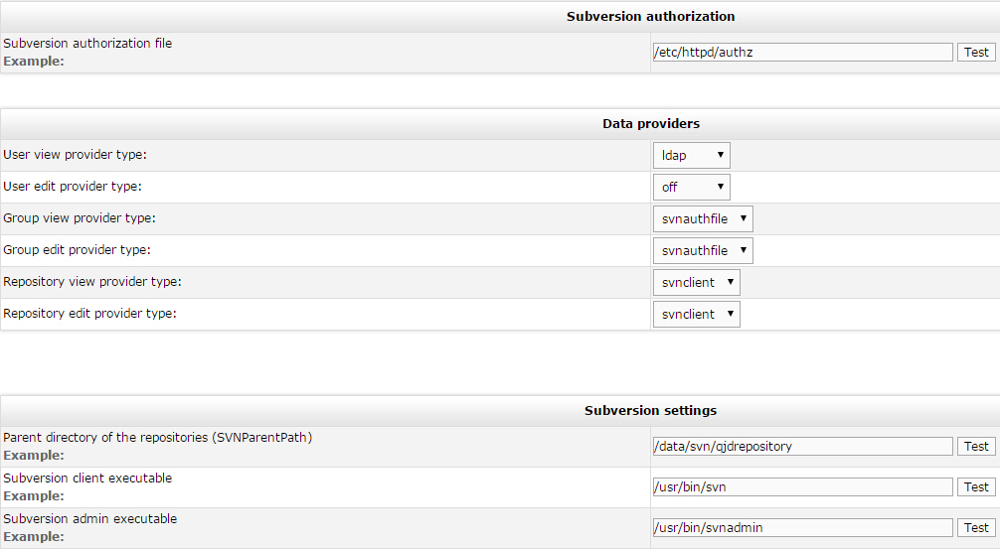
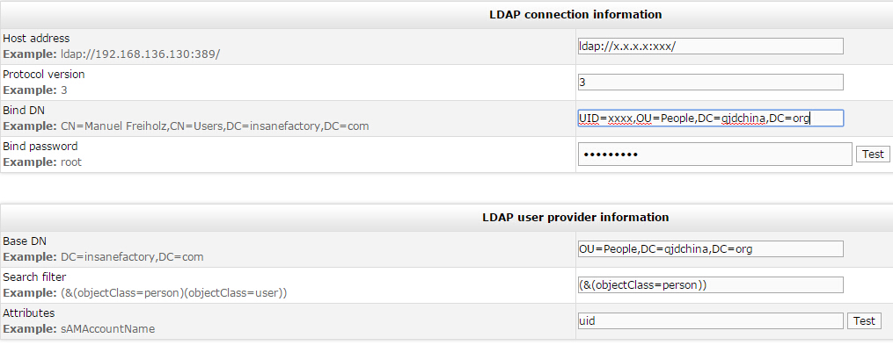

# for svn

## httpd集成svn

1、安装apache，和svn模块等，apache设置虚拟主机。

(1)file认证

    <VirtualHost x.x.x.x:80>
    ServerName svn.xxxxx.org
    ErrorLog /var/log/httpd/svn-error_log
    CustomLog /var/log/httpd/svn-access_log common

    <Location /svn/repos>
        DAV svn
        #SVNPath /path/svn/repository        ## 单一svn仓库
        SVNParentPath /path/svn/repository   ## 多个svn仓库
        AuthzSVNAccessFile /path/svnconf/authz  ## 权限认证文件

        AuthType Basic
        AuthName "Please input u&p"
        AuthUserFile /path/svnconf/pwfile  ## 用户账号:密码文件
        Require valid-user
    </Location>

    </VirtualHost>

(2)ldap、file认证 

    <Location /svn/repos>
        DAV svn
        SVNParentPath /path/svn/repository
        AuthzSVNAccessFile /path/svnconf/authz

        AuthType Basic
        AuthName "Please input u&p"
        AuthzLDAPAuthoritative off
        AuthBasicProvider ldap file  ## 先认证ldap，没有的再认证file
        AuthLDAPBindDN "uid=serviceuser,ou=People,dc=qjdchina,dc=org"
        AuthLDAPBindPassword xxxxxxxx
        AuthLDAPURL "ldap://IP:PORT/ou=People,dc=qjdchina,dc=org?uid?sub?(objectClass=person)"
        AuthUserFile /path/svnconf/pwfile
        Require valid-user
    </Location>

2、在`/path/svn/repository`中用svnadmin创建svn仓库。

3、账号文件和权限文件

(1)账号文件

    $ cat ../pwfile
    user1:DQQIc6uZcW2bg
    user2:axDnsksqIPcCU
    ......

(2)权限文件

    $ cat ../authz
    ## svn control file
    [aliases]

    [groups]
    admin = user1,user2
    dev = user3,user4,...
    qa = user2,user5,...

    [/]
    @admin = rw

    [repo1:/]
    @qa = rw

    [repo2:/]
    * = r
    @admin = rw
    @dev = rw
    @qa = rw

    [repo2:/Apps/branch/Zeus]
    * = r
    [repo2:/Apps/branch/Zeus0.0.1]
    * = r

4、可使用开源软件SvnAdmin管理仓库

(1)file

  

(2)ldap

  

  

## httpd虚拟主机其他设置

(1)webdav

    Alias /dav /path/webdav
    <Location /dav>
        DAV On
        Options +Indexes
        IndexOptions FancyIndexing FoldersFirst
        AddDefaultCharset UTF-8

        AuthType Basic
        AuthName "Please input u&p"
        AuthzLDAPAuthoritative off
        AuthBasicProvider ldap file
        AuthLDAPBindDN "uid=xxx,ou=xxx,dc=qjdchina,dc=org"
        AuthLDAPBindPassword xxxxxxxxxxxxxx
        AuthLDAPURL "ldap://IP:PORT/ou=People,dc=qjdchina,dc=org?uid?sub?(objectClass=person)"
        AuthUserFile /path/svnconf/pwfile
        Require valid-user
    </Location>

(2)self-service-password

    Alias /pw /path/self-service-password
    <Location /pw>
        DirectoryIndex index.php
        AddDefaultCharset UTF-8
        Order Deny,Allow
        Deny from all
        Allow from 183.129.243.163
        #Allow from all
    </Location>

> https://github.com/daniel-djx/self-service-password.git

> commit 1ce1f8ac3629f0f8be78de4c6ab376e524a932eb

    diff --git a/conf/config.inc.php b/conf/config.inc.php
    index da42a38..656f99c 100644
    --- a/conf/config.inc.php
    +++ b/conf/config.inc.php
    @@ -23,10 +23,10 @@
     # Configuration
     #==============================================================================
     # LDAP
    -$ldap_url = "ldap://localhost";
    -$ldap_binddn = "cn=manager,dc=example,dc=com";
    -$ldap_bindpw = "secret";
    -$ldap_base = "dc=example,dc=com";
    +$ldap_url = "ldap://x.x.x.x:xxx";
    +$ldap_binddn = "cn=xxxx,dc=qjdchina,dc=org";
    +$ldap_bindpw = "xxxxx";
    +$ldap_base = "ou=People,dc=qjdchina,dc=org";
     $ldap_login_attribute = "uid";
     $ldap_fullname_attribute = "cn";
     $ldap_filter = "(&(objectClass=person)($ldap_login_attribute={login}))";
    @@ -57,12 +57,12 @@ $shadow_options['update_shadowLastChange'] = false;
     # CRYPT
     # clear (the default)
     # This option is not used with ad_mode = true
    -$hash = "clear";
    +$hash = "SSHA";

     # Local password policy
     # This is applied before directory password policy
     # Minimal length
    -$pwd_min_length = 0;
    +$pwd_min_length = 6;
     # Maximal length
     $pwd_max_length = 0;
     # Minimal lower characters
    @@ -76,16 +76,16 @@ $pwd_min_special = 0;
     # Definition of special characters
     $pwd_special_chars = "^a-zA-Z0-9";
     # Forbidden characters
    -#$pwd_forbidden_chars = "@%";
    +$pwd_forbidden_chars = "*()&|";
     # Don't reuse the same password as currently
     $pwd_no_reuse = true;
     # Complexity: number of different class of character required
    -$pwd_complexity = 0;
    +$pwd_complexity = 2;
     # Show policy constraints message:
     # always
     # never
     # onerror
    -$pwd_show_policy = "never";
    +$pwd_show_policy = "onerror";
     # Position of password policy constraints message:
     # above - the form
     # below - the form
    @@ -101,7 +101,7 @@ $who_change_password = "user";
     # Use questions/answers?
     # true (default)
     # false
    -$use_questions = true;
    +$use_questions = false;

     # Answer attribute should be hidden to users!
     $answer_objectClass = "extensibleObject";
    @@ -125,26 +125,26 @@ $token_lifetime = "3600";
     ## Mail
     # Mail settings
     $smtp_params = array(
    -    "host" => "smtp.example.com",
    +    "host" => "smtp.exmail.qq.com",
	 "port" => "25",
     # Whether or not to use SMTP authentication. Default is FALSE.
    -    # "auth" => true,
    +    "auth" => true,
	 # If the auth value is true, username and password is required.
    -    # "username" => "username",
    -    # "password" => "password",
    +    "username" => "xxx@htrader.cn",
    +    "password" => "xxxxxxxxxxxxxx",
	 # The SMTP connection timeout. Default is NULL (no timeout).
	 # "timeout" => NULL,
     );
     # LDAP mail attribute
     $mail_attribute = "mail";
     # Who the email should come from
    -$mail_from = "admin@example.com";
    +$mail_from = "xxx@htrader.cn";
     # Notify users anytime their password is changed
    -$notify_on_change = false;
    +$notify_on_change = true;

     ## SMS
     # Use sms
    -$use_sms = true;
    +$use_sms = false;
     # GSM number attribute
     $sms_attribute = "mobile";
     # Send SMS mail to address
    @@ -164,17 +164,17 @@ $show_help = true;
     $lang ="en";

     # Logo
    -$logo = "style/ltb-logo.png";
    +$logo = "style/Passwd.png";

     # Debug mode
    -$debug = false;
    +$debug = true;

     # Encryption, decryption keyphrase
    -$keyphrase = "secret";
    +$keyphrase = "ldapqjd";

     # Where to log password resets - Make sure apache has write permission
     # By default, they are logged in Apache log
    -#$reset_request_log = "/var/log/self-service-password";
    +$reset_request_log = "/var/log/httpd/dav-access_log";

     # Invalid characters in login
     # Set at least "*()&|" to prevent LDAP injection
    @@ -185,8 +185,8 @@ $login_forbidden_chars = "*()&|";
     # Use Google reCAPTCHA (http://www.google.com/recaptcha)
     # Go on the site to get public and private key
     $use_recaptcha = false;
    -$recaptcha_publickey = "";
    -$recaptcha_privatekey = "";
    +$recaptcha_publickey = "xxxxx";
    +$recaptcha_privatekey = "xxxxxx";
     # Customize theme (see http://code.google.com/intl/de-DE/apis/recaptcha/docs/customization.html)
     # Examples: red, white, blackglass, clean
     $recaptcha_theme = "white";
    @@ -201,7 +201,7 @@ $default_action = "change";

     ## Extra messages
     # They can also be defined in lang/ files
    -#$messages['passwordchangedextramessage'] = NULL;
    -#$messages['changehelpextramessage'] = NULL;
    +$messages['passwordchangedextramessage'] = "Congratulations, you can use the new password now !";
    +$messages['changehelpextramessage'] = "Contact xxxx@htrader.cn if you need additional help.";

     ?>
    diff --git a/pages/resetbytoken.php b/pages/resetbytoken.php
    index 1b36c03..7aa48fd 100644
    --- a/pages/resetbytoken.php
    +++ b/pages/resetbytoken.php
    @@ -30,6 +30,7 @@ $login = "";
     $token = "";
     $tokenid = "";
     $newpassword = "";
    +$oldpassword = "";
     $confirmpassword = "";
     $ldap = "";
     $userdn = "";
