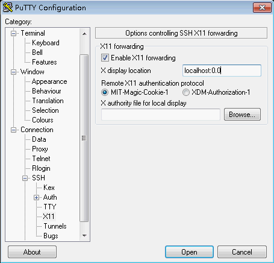
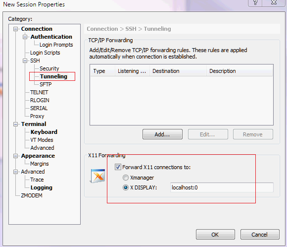
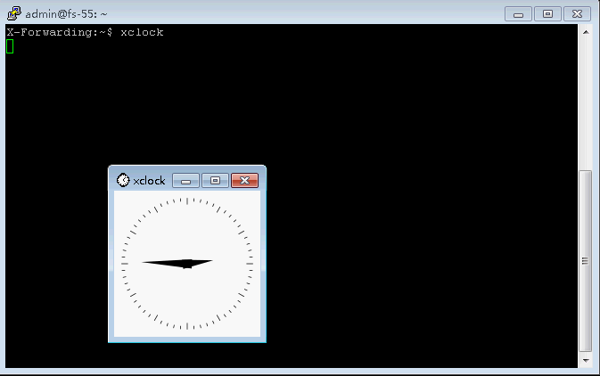
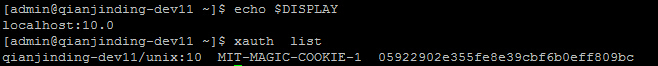
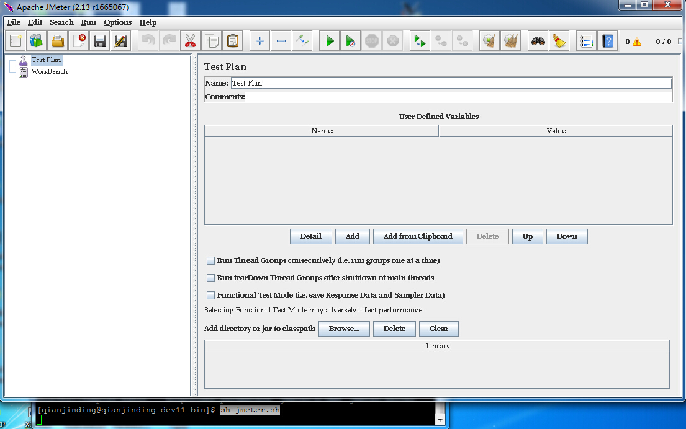
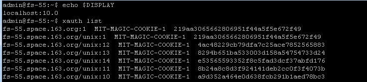
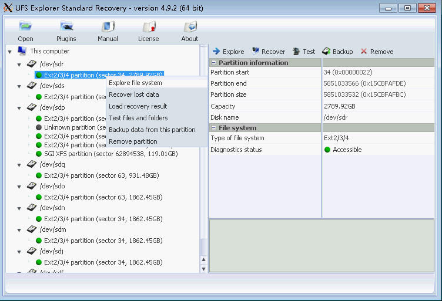
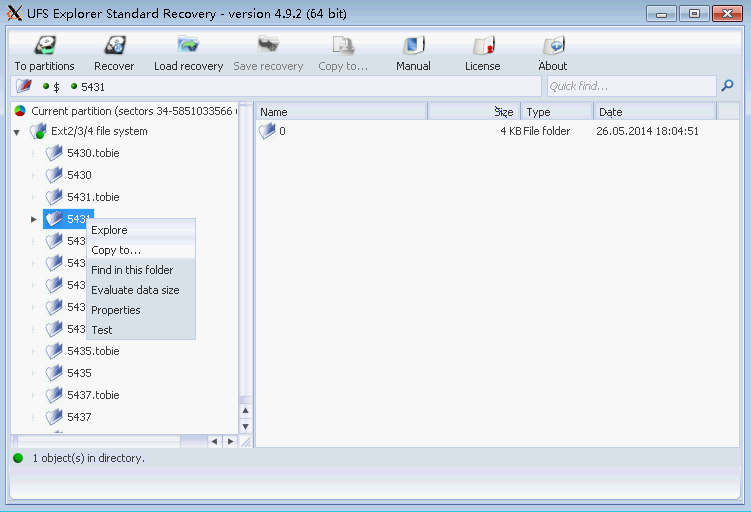
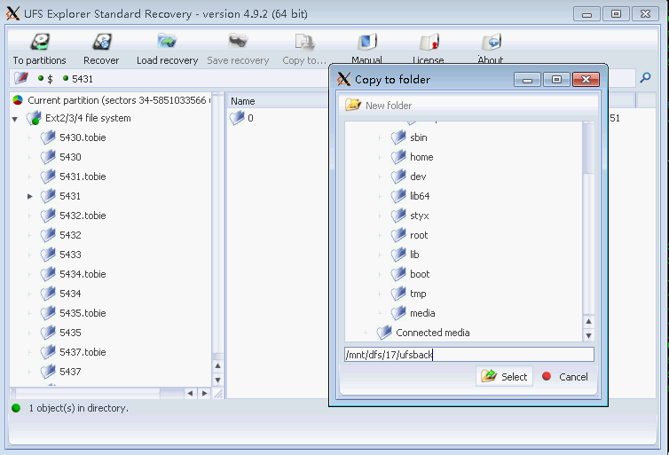

# X11 Forwarding

**X Window System** 也常称X11或X，是一种位图显示窗口系统，是(类)unix以及OpenVMS等操作系统上建立用户界面的标准包和协议。目前以[X.Org](http://www.x.org/wiki/)的实现最为普遍且受欢迎，其协议版本为11。

**X11 Forwarding** 是X的一个功能，它可以让程序运行在一台主机上，而用户在另外一台(有图形界面的)机器上与之交互。X Window System里有一个统一的X Server来负责各个程序与显示器、键盘和鼠标等输入输出设备的交互，每个有GUI的应用程序都通过网络协议与X Server进行交互。

### SSH + X11 Forwarding

OpenSSH具有X11 Forwarding功能，可以将X程序通过SSH的管道转发。这个特性使得X Client和X Server安全、方便地通讯，常常应用于远端的Linux服务器为文本界面，需要运行基于图形的软件，如xclock。打开服务器上Openssh对应的X11 Forwarding项，编辑/etc/ssh/sshd_config如下行：

    X11Forwarding yes

安装X11认证工具软件包。

    yum/apt-get install xorg-x11-xauth

__Windowns:__

1.首先需要在本地Windows上运行一个X Server，我们使用标准X.Org X Server的Windows移植版本[Xming](http://www.straightrunning.com/XmingNotes/)，也可以在[sourceforge](http://sourceforge.net/projects/xming/files/)上下载。

> 启动XMing后系统右下角任务栏出现图标,表示Xming已经运行。将鼠标悬停在上面会有`Xming server:0.0`的字样，表明你的X Server的Display number是0。

2.设置putty等SSH客户端。这里仅说明X11 Forwarding的配置，其他putty设置请参考[这里](http://wiki.htrader.cn/SSH-Clients)。

在putty界面的左边点击Connection--->SSH--->X11菜单，选中Enable X11 Forwarding, 在X display location中输入`localhost:0:0`或`localhost:0`。

  

xshell的设置类似：

  

3.通过putty等SSH客户端登录服务器后，输入`xclock`命令出现图形界面的时钟窗口。如果出现`Error: Can't open display:`报错，可能是服务器端没有安装`xorg-x11-xauth`。

  

__Linux:__

1.Linux主机图形界面下本身已经启动X，可直接使用ssh的-X参数启用X11 forwarding。

    ssh -X ip/host -l user -p port

2.登录后使用`xclock`命令查看图形时钟。

### 实际使用一

某服务器需要使用Apache JMeter进行压力测试。由于JMeter依赖图形界面，因此要使用X11 Forwarding来实现本地图形主机操作服务器上的JMeter。

1.如上述，设置X11 Forwarding登录到服务器，可使用xclock检测是否成功。

2.输入`echo $DISPLAY`，查看当前Display number，并使用`xauth list`查看X Client的DISPLAY认证记录。其中`qianjinding-dev11/unix:10  MIT-MAGIC-COOKIE-1  05922902e355fe8e39cbf6b0eff809bc`是当前用户的X Client的认证记录。

  

3.由于JMeter部署在部署账号qianjinding下，因此需要切换到qianjinding账号下，并将上面得到的认证记录加入到仟金顶账号下，用`xauth list`查看加入后的记录。

    admin@qianjinding-dev11:~# sudo -iu qianjinding
    qianjinding@qianjinding-dev11:~# xauth add qianjinding-dev11/unix:10  MIT-MAGIC-COOKIE-1  05922902e355fe8e39cbf6b0eff809bc

> 注意，如果报错`xauth:  file /home/qianjinding/.Xauthority does not exist`，则需要使用`touch /home/qianjinding/.Xauthority`手动创建此文件先。

4.运行JMeter。

  

### 实际运用二

某服务器需要使用UFS Explorer对磁盘进行数据恢复。由于UFS Explorer依赖图形界面，因此要使用X11 Forwarding来实现本地图形主机操作服务器上的UFS Explorer。

1.由于需要root权限来对磁盘操作，因此使用sudo来做权限控制，在/etc/sudoers中授予admin用户sudo权限。

    admin     fs-55.space.163.org=NOPASSWD: /usr/bin/ufsxsci

2.如上述，设置X11 Forwarding登录到服务器，可使用xclock检测是否成功。

3.输入`echo $DISPLAY`，查看当前Display number，并使用`xauth list`查看X Client的DISPLAY认证记录。其中`fs-55.space.163.org/unix:10  MIT-MAGIC-COOKIE-1  a9d352a464e0d638fcb291b1aed78bc3`是当前用户的X Client的认证记录。

  

4.root使用`xauth add`命令增加此认证记录，否则X Server将验证失败，导致执行`sudo /usr/bin/ufsxsci`报错，无法正确运行。多个登录会有多个Display number，需要依次增加多个认证记录。

> 注意：普通用户直接执行`/usr/bin/ufsxsci`或`ufsxsci`没有sudo(root)权限，程序可以运行，但是将没有权限对磁盘进行操作。

    root@fs-55:~# xauth  add fs-55.space.163.org/unix:10  MIT-MAGIC-COOKIE-1  a9d352a464e0d638fcb291b1aed78bc3

或使用`xauth merge /home/user/.Xauthority`直接从用户的认证文件merge。

5.执行`sudo /usr/bin/ufsxsci`，进行数据恢复。这里假设操作/dev/sdr，选中后，右键--->Explore file system。

  

6.选定要恢复的目录或文件，右键--->Copy to...。

  

7.在弹出的Copy to folder窗口中选择要保存恢复数据的目标目录，也可直接手动填写。最后选择并单击`Select`即开始复制要恢复的数据。

  

8.在保存恢复数据的目录下，使用`watch  du -shc *`命令，可实时监控恢复数据的大小。
