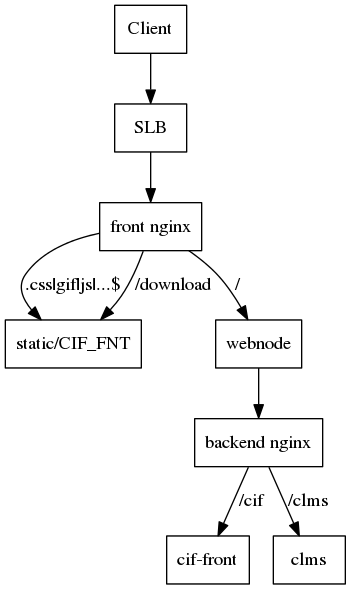
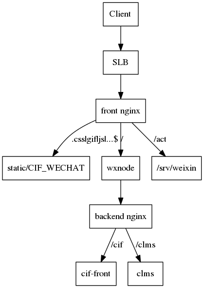
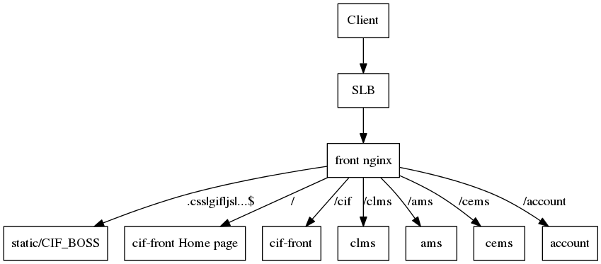

# Nginx Arch

## 前台

  

## 微信

  

## 后台

  

## nginx后端应用获取客户端真实IP

nginx 已配置，将客户端真实IP传给`X-FROM-IP`，后端服务器可通过如下变量`x-from-ip`、`x_from_ip`、`http_x_from_ip`中的一个获取。

具体使用哪个变量，视后端服务可能有所不同，如nodejs获取客户端的真实IP，通过`x-from-ip`：

      headers:
       { 'x-forwarded-for': '192.128.166.188',
         'x-from-ip': '192.128.166.188',
         host: 'htrader.cn',
         connection: 'close',
         accept: '*/*',
         referer: 'https://htrader.cn/aboutus',
         'accept-language': 'zh-cn',
         'user-agent': 'Mozilla/4.0 (compatible; MSIE 8.0; Windows NT 5.1; Trident/4.0)',
         'accept-encoding': 'gzip, deflate',
         cookie: 'SERVERID=xxxx; JSESSIONID=xxxx' } }
