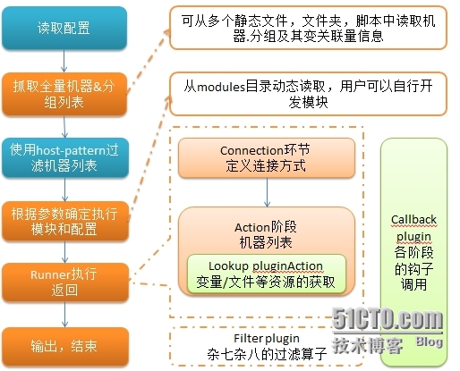

# ansible

## 常用的自动化运维工具

Puppet 基于 Ruby 开发，采用 C/S 架构，扩展性强，基于 SSL，远程命令执行相对较弱

SaltStack 基于 Python 开发，采用 C/S 架构，相对 puppet 更轻量级，配置语法使用 YMAL，使得配置
脚本更简单

Ansible  基于 Python paramiko 开发，分布式，无需客户端，轻量级，配置语法使用 YMAL 及 Jinja2
模板语言，更强的远程命令执行操作

## ansible 基础

<b>简介</b>

ansible是新出现的自动化运维工具，基于Python开发，集合了众多运维工具（puppet、cfengine、chef、func、fabric）的优点，实现了批量系统配置、批量程序部署、批量运行命令等功能。ansible是基于模块工作的，本身没有批量部署的能力。真正具有批量部署的是ansible所运行的模块，ansible只是提供一种框架。主要包括：

(1)、连接插件connection plugins：负责和被监控端实现通信；

(2)、host inventory：指定操作的主机，是一个配置文件里面定义监控的主机；

(3)、各种模块核心模块、command模块、自定义模块；

(4)、借助于插件完成记录日志邮件等功能；

(5)、playbook：剧本执行多个任务时，非必需可以让节点一次性运行多个任务。

----------

<b>架构</b>

----------

<b>特性</b>

(1)、no agents：不需要在被管控主机上安装任何客户端；

(2)、no server：无服务器端，使用时直接运行命令即可；

(3)、modules in any languages：基于模块工作，可使用任意语言开发模块；

(4)、yaml，not code：使用yaml语言定制剧本playbook；

(5)、ssh by default：基于SSH工作；

(6)、strong multi-tier solution：可实现多级指挥。

----------

<b>优点</b>

(1)、轻量级，无需在客户端安装agent，更新时，只需在操作机上进行一次更新即可；

(2)、批量任务执行可以写成脚本，而且不用分发到远程就可以执行；

(3)、使用python编写，维护更简单，ruby语法过于复杂；

(4)、支持sudo。

----------

<b>任务执行流程</b>

----------

<b>ansible 学习地址</b>

http://sofar.blog.51cto.com/353572/1579894/

http://ansible.com.cn/docs/intro.html

http://www.simlinux.com/books/Ansible-notes.pdf

http://breezey.blog.51cto.com/2400275/d-3

## ansible 安装

安装方式有三种：

安装前先确认python已安装（redhat/CentOS 默认已装好python，其中CentOS 6.x 发行版本默认安装的python版本为 2.6.x,CentOS 7.x 发行版本默认安装的python版本为 2.7.x，推荐python版本为2.7.x。

<b>1、 yum安装</b>

	sudo yum install ansible

<b>2、 pip安装</b>

安装pip

	sudo yum install python-pip
	sudo pip install pip --upgrade

安装其它环境

	sudo yum install gcc gcc-c++ python-devel openssl openssl-devel
	sudo pip install pycrypto
	sudo pip install PyYaml
	sudo pip install jinja2
	sudo pip install paramiko
	sudo pip install simplejson
	
最后安装ansible

	sudo pip install ansible
	sudo mkdir /etc/ansible
	sudo chown admin.admin /etc/ansible
	sudo vim /etc/ansible/hosts (里面填要管理主机的地址)
	

<b>3、 源码安装</b>

前面的环境安装参照pip安装ansible之前的步骤,然后再安装ansible

	git clone git://github.com/ansible/ansible.git
	cd ansible
	git submodule update --init --recursive
	source hacking/env-setup
	sudo mkdir /etc/ansible
	sudo chown admin.admin /etc/ansible
	sudo vim /etc/ansible/hosts (里面填要管理主机的地址)
	
## ansible 使用

<b>Ad-hoc</b>

Ad-Hoc 是指ansible下临时执行的一条命令，并且不需要保存的命令，对于复杂的命令会使用playbook。Ad-hoc的执行依赖于模块，ansible官方提供了大量的模块。 如：command、raw、shell、file、cron等，具体可以通过ansible-doc -l 进行查看 。可以使用ansible-doc -s module来查看某个模块的参数，也可以使用ansible-doc help module来查看该模块更详细的信息。

一个ad-hoc命令的执行，需要按以下格式进行执行：

    ansible 主机或组-m 模块名-a '模块参数'  ansible参数
	例如: ansible 10.1.31.31 -m shell -a "df -Th"
		  ansible 10.1.31.31 -m ping 

主机和组:是在/etc/ansible/hosts 里进行指定的部分，当然动态Inventory 使用的是脚本从外部应用里获取的主机；

模块名:可以通过ansible-doc -l 查看目前安装的模块，默认不指定时，使用的是command模块，具体可以查看/etc/ansible/ansible.cfg 的“#module_name = command ” 部分，默认模块可以在该配置文件中进行修改；
模块参数，可以通过 “ansible-doc -s 模块名” 查看具体的用法及后面的参数；

ansible参数:可以通过ansible命令的帮助信息里查看到，这里有很多参数可以供选择，如是否需要输入密码、是否sudo等。

当命令执行时间比较长时，也可以放到后台执行，使用-B、-P参数，如下：

	ansible all -B 3600-a "/usr/bin/long_running_operation --do-stuff" #后台执行命令3600s，-B 表示后台执行的时间
    ansible all -m async_status -a "jid=123456789"  #检查任务的状态
    ansible all -B 1800-P 60-a "/usr/bin/long_running_operation --do-stuff" #后台执行命令最大时间是1800s即30分钟，-P 每60s检查下状态，默认15s

----------

<b>Playbook</b>

ansbile-playbook是一系列ansible命令的集合，利用yaml 语言编写。playbook命令根据自上而下的顺序依次执行。同时，playbook开创了很多特性,它可以允许你传输某个命令的状态到后面的指令,如你可以从一台机器的文件中抓取内容并附为变量,然后在另一台机器中使用,这使得你可以实现一些复杂的部署机制,这是ansible命令无法实现的。

playbook通过ansible-playbook命令使用,它的参数和ansible命令类似,如参数-k(–ask-pass) 和 -K (–ask-sudo) 来询问ssh密码和sudo密码,-u指定用户,这些指令也可以通过规定的单元写在playbook 。

ansible-playbook的简单使用方法: 
	
	ansible-playbook example-play.yaml 
	例如: ansible-playbook mysql.yaml

playbook是由一个或多个"play"组成的列表。play的主要功能在于将事先归并为一组的主机装扮成事先通过ansible中的task定义好的角色。从根本上来讲所谓task无非是调用ansible的一个module。将多个play组织在一个playbook中即可以让它们联同起来按事先编排的机制同唱一台大戏。其主要有以下四部分构成:
playbooks组成：

1.   Target section：   定义将要执行 playbook 的远程主机组
1.   Variable section： 定义 playbook 运行时需要使用的变量
1.   Task section：     定义将要在远程主机上执行的任务列表
1.   Handler section：  定义 task 执行完成以后需要调用的任务
	
playbook 例子：

	- name: zabbix manage
	  hosts: all
	  remote_user: admin
	  sudo: yes
  	  tasks:
  		- name: install zabbix
    	  yum:
      		name: zabbix22-agent
      		state: present

  		- name: copy zabbix.cfg CentOS6
          template: src=templates/zabbix_agentd.conf.j2 dest=/etc/zabbix/zabbix_agentd.conf owner=zabbix group=zabbix mode=0644
    	  notify: reload zabbix-agentd CentOS6
    	  when: ansible_distribution_major_version == "6"

  		- name: copy zabbix.cfg CentOS7
    	  template: src=templates/zabbix_agentd.conf.j2 dest=/etc/zabbix/zabbix_agentd.conf owner=zabbix group=zabbix mode=0644
    	  notify: reload zabbix-agentd CentOS7
    	  when: ansible_distribution_major_version == "7"

  		- name: start zabbix agent service
    	  service:
      	  name: zabbix-agent
      	  state: started

	  handlers:
        - name: reload zabbix-agentd CentOS6
      	  shell: /usr/bin/sleep 5; /etc/init.d/zabbix-agent force-reload

        - name: reload zabbix-agentd CentOS7
          shell: /usr/bin/sleep 5; /bin/systemctl force-reload zabbix-agent.service
