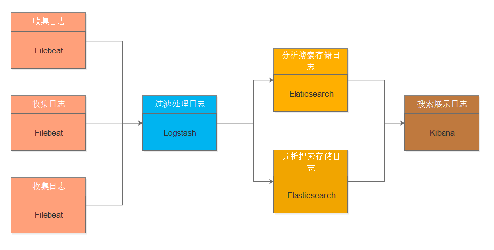
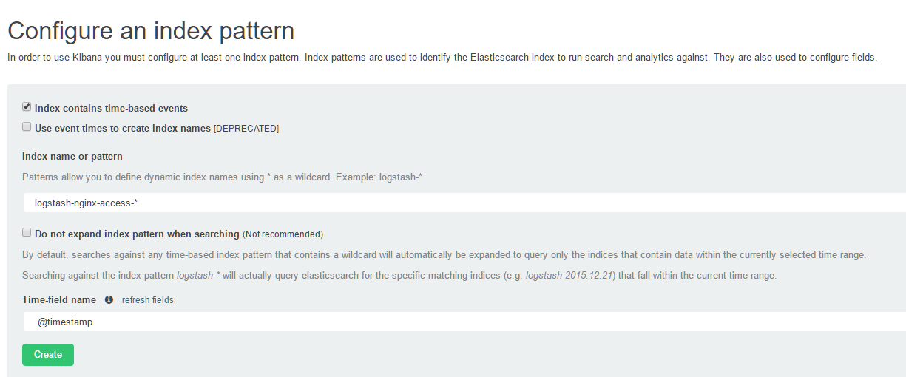

# elk日志管理系统---运维篇

----------

## 当前环境

**线下环境：**

- ***logstash地址:*** 10.1.31.33
- ***elasticsearch地址:*** 10.1.31.33、10.1.31.34 ***web管理地址:*** [elasticsearch-33](http://10.1.31.33:9200/_plugin/head/)、 [elasticsearch-34](http://10.1.31.34:9200/_plugin/head/)
- ***kibana地址:*** 10.1.31.34 ***web管理地址：*** [kibana-dev](http://kibanadev.htrader.cn/)

**线上环境：**

- ***logstash地址:*** 10.252.129.50
- ***elasticsearch地址:*** 10.252.129.50、10.161.219.104 ***web管理地址:*** [elasticsearch-online](http://ela.htrader.cn/_plugin/head/)
- ***kibana地址:*** 10.161.219.104 ***web管理地址：*** [kibana-online](http://kibana.htrader.cn/)

**线上环境：**
## elk简介

　　elk其实并不是一款软件，而是一整套解决方案，是三个软件产品的首字母缩写，Elasticsearch，Logstash 和 Kibana。这三款软件都是开源软件，通常是配合使用，而且又先后归于 Elastic.co 公司名下，故被简称为 elk 协议栈

　　一个完整的集中式日志系统，离不开以下几个特点：

- 收集－能够采集多种来源的日志数据
- 传输－能够稳定的把日志数据传输到中央系统
- 存储－如何存储日志数据
- 分析－可以支持 UI 分析
- 警告－能够提供错误报告，监控机制

**Elasticsearch：**
 　　Elasticsearch 是一个实时的分布式搜索和分析引擎，它可以用于全文搜索，结构化搜索以及分析。它是一个建立在全文搜索引擎 Apache Lucene 基础上的搜索引擎，同时也用来存储日志，使用 Java 语言编写。
 　　主要特点：

- 实时分析
- 分布式实时文件存储，并将每一个字段都编入索引
- 文档导向，所有的对象全部是文档
- 高可用性，易扩展，支持集群（Cluster）、分片和复制（Shards 和 Replicas）
- 接口友好，支持 JSON

**Logstash：**
 　　Logstash 是一个具有实时渠道能力的数据收集引擎。使用 JRuby 语言编写。
 　　主要特点：

- 几乎可以访问任何数据
- 可以和多种外部应用结合
- 支持弹性扩展

　　它由三个主要部分组成：

- Shipper－发送日志数据
- Broker－收集数据，缺省内置 Redis
- Indexer－数据写入

**Kibana：**
 　　Kibana 是一款基于 Apache 开源协议，使用 JavaScript 语言编写，为 Elasticsearch 提供分析和可视化的 Web 平台。它可以在 Elasticsearch 的索引中查找，交互数据，并生成各种维度的表图。

**Filebeat：**
 　　filebeat最初是基于logstash-forwarder源码的日志数据shipper。Filebeat安装在服务器上作为代理来监视日志目录或特定的日志文件，要么将日志转发到Logstash进行解析，要么直接发送到Elasticsearch进行索引。除了filebeat，根据需求可以有选择性的安装topbeat、packetbeat等工具。

Filebeat架构如下：

## 架构

**当前架构如下：**

**软件下载地址：**　[elk下载链接](https://www.elastic.co/downloads)

后期架构可以加上消息中间件

## 配置与使用

**Filebeat：**

　　Filebeat使用的配置文件为filebeat.yml，需要配置的内容如下：
    
    filebeat:
      prospectors:
        -
        paths:
          - /var/log/messages  //需要收集日志的路径
        document_type: syslog  //日志类型，logstash接受日志后根据日志类型进行处理
        fields:                //下面为额外添加字段
          type: syslog
    output:                    //将日志输出到下一个工具进行处理
      logstash:
        hosts: ["10.1.31.33:5044"]
    shipper:
    logging:
      files:

**Logstash：**

　　Logstash的配置文件主要由input、filter、output三部分组成，其中在input之前还可以再加正则部分，可以用正则来将日志中的字段截取出来，如果是nginx的访问日志，可以直接开启json格式，这样可以直接在elasticsearch中看到处理好的字段。

　　Logstash中可以直接使用github中已经写好的正则表达式，具体请参考：[github-grok](https://github.com/elastic/logstash/blob/v1.4.2/patterns/grok-patterns)
    
　　**logstash-stdin.conf：**
    
    input {
      beats {
        port  => 5044
        type  => "dev_log"
        codec => json {          //输入的数据类型选json
          charset => "UTF-8"
        }
      }
    }

　　**logstash-filter.conf：**
    
    filter {
      if [type] == "java_log" {         //该type为 filebeat中的 document_type
        multiline {                     //多行合并输出
          pattern => "^\d+\-\d+\-\d+"   //匹配条件
          negate  => true               //正向匹配
          what    => "previous"         //符合上面的正则要求后，合并到上一条输出
        }
      }
      if [type] == "nginx_access_log" {
        geoip {                                    //地图功能需要用到
          source    => "@fields[remote_addr]"
          target    => "geoip"
          database  => "/etc/logstash/GeoLiteCity.dat"
          add_field => [ "[geoip][coordinates]", "%{[geoip][longitude]}" ]  //添加字段
          add_field => [ "[geoip][coordinates]", "%{[geoip][latitude]}"  ]
        }
        mutate {
          convert   => [ "[geoip][coordinates]", "float"]   //数据类型转换
        }
      }
    }

　　**logstash-javalog.conf：**

    output {
      if [type] == "java_log" {
        elasticsearch {                           //把日志发送到elasticsearch中
          hosts           => "10.1.31.33:9200"
          sniffing        => true                 //
          manage_template => false                //关闭logstash自动管理模板功能 
          index           => "logstash-java-%{+YYYY.MM.dd}"  //索引名，kibana里面需要用到
          document_type   => "%{[@metadata][type]}"
        }
      if "ERROR" in [message] and "Exception" in [message] and "dubbo" not in [message] {
        email {                                   //通过邮件进行报警
          to       => "ops@htrader.cn"
          from     => "xxx@htrader.cn"
          address  => "smtp.htrader.cn"
          username => "xxx@htrader.cn"
          password => "xxxxxx"
          subject  => "java日志报错 日志级别 [ERROR]"
          body     => "报错信息如下:\n    日志所在主机: %{host}\n    日志路径: %{source}\n    日志内容: %{message}"
        }
      }
    }

　　**logstash-nginxlog.conf：** 注意：如果使用默认的数据模板和地图功能，索引必须以logstash开头，否则需要修改模板的判断条件

    output {
      if [type] == "nginx_access_log" {
      elasticsearch {
        hosts           => "10.1.31.33:9200"
        sniffing        => true
        manage_template => true
        index           => "logstash-nginx-access-%{+YYYY.MM.dd}" 
        document_type   => "%{[@metadata][type]}"
      }
      if [@fields][status] =~ "5\d+" {  //对状态码进行监控，如果出现5xx的状态码则进行邮件报警
        email {
          to       => "ops@htrader.cn"
          from     => "xxx@htrader.cn"
          address  => "smtp.htrader.cn"
          username => "xxx@htrader.cn"
          password => "xxxxxx"
          subject  => "nginx日志出现异常状态码 %{@fields[status]}"
          body     => "相关信息如下:\n    日志所在主机: %{host}\n    日志路径: %{source}\n    日志内容: %{@fields}"
        }
      }
    } else if [type] == "nginx_error_log" {
      elasticsearch {
        hosts           => "10.1.31.33:9200"
        sniffing        => true
        manage_template => true
        index           => "logstash-nginx-error-%{+YYYY.MM.dd}"
        document_type   => "%{[@metadata][type]}"
      }
      email {                           //对nginx错误日志进行监控报警
        to       => "ops@htrader.cn"
        from     => "xxx@htrader.cn"
        address  => "smtp.htrader.cn"
        username => "xxx@htrader.cn"
        password => "xxxxxx"
        subject  => "nginx出现错误日志"
        body     => "相关信息如下:\n    日志所在主机: %{host}\n    日志路径: %{source}\n    日志内容: %{message}"
        }
      }  
    }

　　**logstash常用类型与参数：**

    output {
      http {
        codec => ... # codec (optional), default: "plain"
        content_type => ... # string (optional)
        format => ... # string, one of ["json", "form", "message"] (optional), default: "json"
        headers => ... # hash (optional)
        http_method => ... # string, one of ["put", "post"] (required)
        mapping => ... # hash (optional)
        message => ... # string (optional)
        url => ... # string (required)
        verify_ssl => ... # boolean (optional), default: true
        workers => ... # number (optional), default: 1
      }
    }

- codec:  数据类型，默认是“plain”，用来指定输出数据的类型
- content_type:  值类型是string，默认没有设置该参数，如果没有特别指明，json格式是application/json，form格式是application/x-www-form-urlencoded
- format:  值可以是json、form、message三种类型，默认是json。用来设置http body的格式，如果是form格式，http body会被影射成一个查询字符串(foo=bar&baz=fizz...)，如果是message格式，http body会被格式化成事件？？？，否则，事件都是以json格式发送
- headers:  值类型是一个hash，默认是没有设置的。默认使用的格式如下：headers => ["X-My-Header", "%{host}"]
- http_method:  值可以是put或者post，默认没有设置。
- mapping:  值是一个hash，默认没有设置，该值可以让你选择事件的一个结构体或者部分发送，例如：mapping => ["foo", "%{host}", "bar", "%{type}"]
- message:  值是字符串，默认没有设置
- url:  值是一个字符串，默认没有设置。可以让你使用http或者https进行put或者post。
- verify_ssl:  值是布尔类型，默认是true，是否验证SSL
- workers:  值是一个数值。默认是1，用来设置工作者数目

　　filter进行过滤：

    filter {
      grep {
        add_field => ... # hash (optional), default: {}
        add_tag => ... # array (optional), default: []
        drop => ... # boolean (optional), default: true
        ignore_case => ... # boolean (optional), default: false
        match => ... # hash (optional), default: {}
        negate => ... # boolean (optional), default: false
        remove_field => ... # array (optional), default: []
        remove_tag => ... # array (optional), default: []
      }
    }

　　注意：grep过滤器，如果你不想通过哪些事件可以把它drop掉，或者给每个匹配的事件增加tags和fields。如果negate的值是true，则匹配到的事件会被丢弃。

- add\_field:  值类型是hash，默认是{} 空。过滤成功，会增加一个field到事件。例如：add\_field => [ "foo\_%{somefield}", "Hello world, from %{host}" ]
- add\_tag:  值类型是array，默认是[] 空。过滤成功，会增加一个tags到事件，例如：add\_tag => [ "foo\_%{somefield}" ]
- drop:  值是布尔类型，默认是true。drop掉不匹配的事件，如果该值设置为false，则不会有事件被drop。
ifnore\_case:  值类型是布尔类型，默认是false。不区分大小写匹配，类似于grep -i，如果是true，则区分大小写
- match:  值是hash类型，默认是{} 空。一个hash匹配field=>regxp。如果有多个匹配，则必须所有的都成功。例如：match => [ "message", "hello world" ]
- negate:  值是布尔类型，默认值是false。类似于grep -v
- remove\_field:  值是array类型，默认是[] 空。如果成功，删除一个fields。
- remove\_tag:  值是array类型，同上。

　　logstash的语法可参考: [Logstash最佳实践](http://udn.yyuap.com/doc/logstash-best-practice-cn/index.html)

**Elasticsearch：**

　　elasticsearch需要对elacsticsearch.yml文件进行配置:

    cluster.name: dev-ela-cluster            //集群名
    node.name: qianjinding-dev33             //节点名
    path.data: /srv/ela_data
    path.logs: /srv/ela_logs
    network.host: "10.1.31.33"           
    discovery.zen.ping.unicast.hosts: ["10.1.31.33", "10.1.31.34"] //集群节点通信的范围
    discovery.zen.minimum_master_nodes: 1    //最小主节点数
    node.master: true                        //主节点，集群节点最好都设为true
    node.data: true
    transport.tcp.port: 9300                 //节点之间通信的端口
    indices.cache.filter.expire: 30d         
    index.cache.filter: 30d                  //数据过期时间

　　elasticsearch这边要登录web界面查看需要安装相关插件，安装管理插件的命令： ***/usr/share/elasticsearch/bin/plugin install mobz/elasticsearch-head*** 

　　如果想深入了解，可参考：[Elasticsearch权威指南](http://wiki.jikexueyuan.com/project/elasticsearch-definitive-guide-cn/)

**Kibanba：**

　　kibana中需要修改的配置文件为kibana.yml：

    elasticsearch.url: "http://10.1.31.33:9200" //只需添加这一行即可

　　kibana根据elasticsearch中存储的索引名字去添加索引

　　Kibana中新添加索引的配置过程：

1. 从浏览器访问 Kibana 界面，例如：***http://kibanadev.htrader.cn/***
2. 指定一个可以匹配一个或者多个 Elasticsearch 索引的 index pattern 。默认情况下，
Kibana 认为你要访问的是通过 Logstash 导入 Elasticsearch 的数据。这时候你可以用默
认的 logstash-* 作为你的 index pattern。通配符(*) 匹配索引名中零到多个字符。如果
你的 Elasticsearch 索引有其他命名约定，输入合适的 pattern。pattern 也开始是最简单
的单个索引的名字。
3. 选择一个包含了时间戳的索引字段，可以用来做基于时间的处理。Kibana 会读取索引的
映射，然后列出所有包含了时间戳的字段。如果你的索引没有基于时间的数据，关闭 Index contains
time-based events 参数。
4. 如果一个新索引是定期生成，而且索引名中带有时间戳，选择 Use event times to
create index names 选项，然后再选择 Index pattern interval 。这可以提高搜索性能，
Kibana 会至搜索你指定的时间范围内的索引。在你用 Logstash 输出数据给
Elasticsearch 的情况下尤其有效
5. 点击 Create 添加 index pattern。第一个被添加的 pattern 会自动被设置为默认值。如果
你有多个 index pattern 的时候，你可以在 Settings > Indices 里设置具体哪个是默认值

　　kibana的具体使用请参考：[elk日志管理系统---用户篇](http://wiki.htrader.cn/environment.common/elk_user)

## 安装部署

　　当前环境elk可以直接通过ansible进行部署，现在相关playbook已经写好，部署过程不需要提前安装软件，到时候只需对hosts的分组进行配置以及相关配置文件进行修改即可

　　部署顺序： **elasticsearch-->logstash-->filebeat-->kibana**

    
    
