# elk日志管理系统---用户篇

----------

### 注意：

　　本篇文档主要是介绍Kibana的使用，如果想了解elk的介绍、线上线下的当前环境、架构以及配置使用可参考: [elk日志管理系统---运维篇](http://wiki.htrader.cn/environment.common/elk_ops) 

### 简介：

　　Kibana 是一款基于 Apache 开源协议，使用 JavaScript 语言编写，为 Elasticsearch 提供分析和可视化的 Web 平台。它可以在 Elasticsearch 的索引中查找，交互数据，并生成各种维度的表图。

## Kibana的使用

　　kibana线上地址: [kibanadev线上链接](http://kibana.htrader.cn)
　　kibana线下地址: [kibanadev线下链接](http://kibanadev.htrader.cn)

### Discover（重点）

　　Discover 标签页用于交互式探索你的数据。你可以访问到匹配得上你选择的索引模式的每个
索引的每条记录。你可以提交搜索请求，过滤搜索结果，然后查看文档数据。你还可以看到
匹配搜索请求的文档总数，获取字段值的统计情况。如果索引模式配置了时间字段，文档的
时序分布情况会在页面顶部以柱状图的形式展示出来。

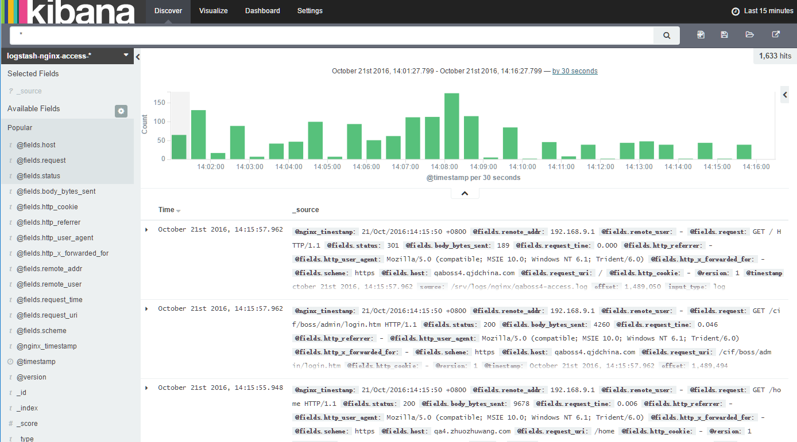

　　搜索过程可以使用时间过滤器对日志进行时间上的过滤，前提条件是索引模式配置了时间字段（默认就有），默认的时间为最近15分钟。你可以用页面顶部的时间选择器来修改时间过滤器，或者选择一个特定的时间间隔，或者直方图的时间范围。

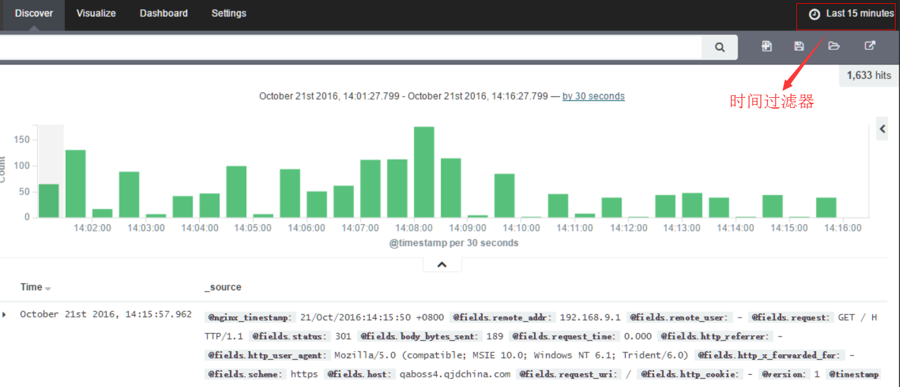

　　拖动直方图可以直接将时间范围缩小到拖动的范围

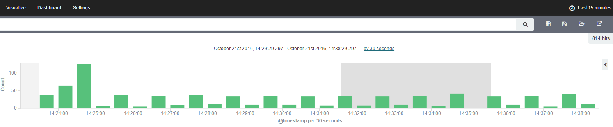

　　点击右上角的时间选择器后，可以对时间选择器进行设置

　　快速选择某个时间范围：

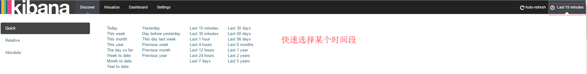

　　指定相对开始时间：

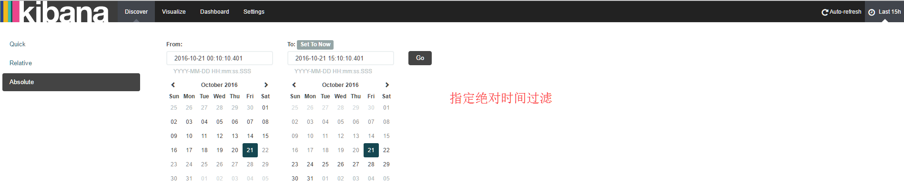

　　指定绝对时间：

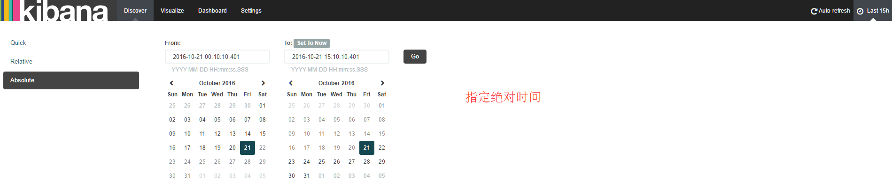

　　根据时间频率自动刷新日志：

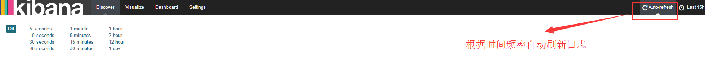

　　对字段的值进行过滤，你可以对左边的字段进行过滤，可以选择具体的值进行过滤，其中+的图标表示正向过滤，-的图标表示反向过滤，但是日志显示的字段数量不变

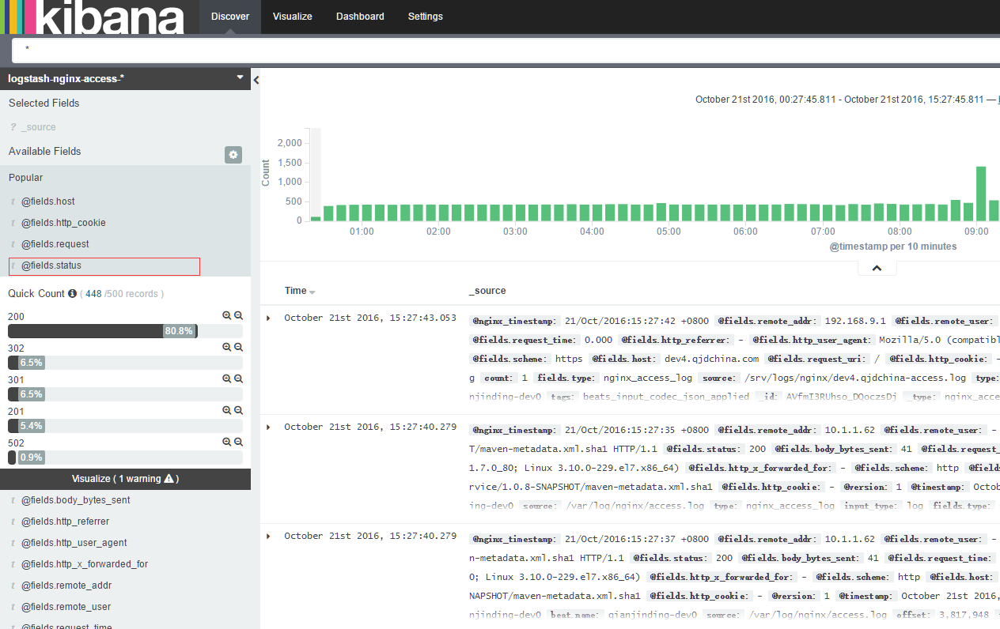

　　对需显示的字段进行过滤（默认会有时间戳字段）,点击add添加需显示的字段，点击remove去除显示的字段：

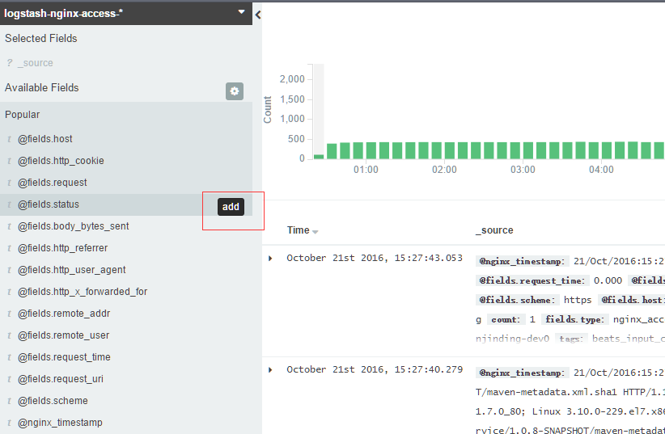

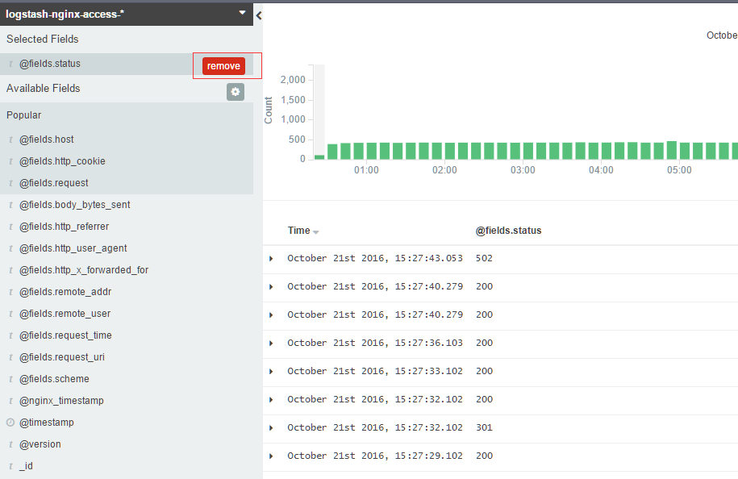

　　对日志内容进行搜索,可以对日志内容进行全文搜索，也可以对某个字段的值进行搜索，还可以根据多个条件进行搜索：

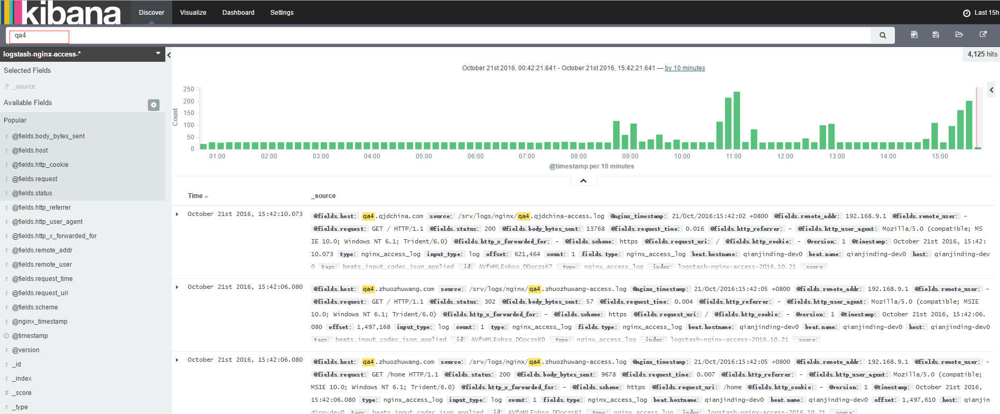

　　对某个字段的值进行搜索：

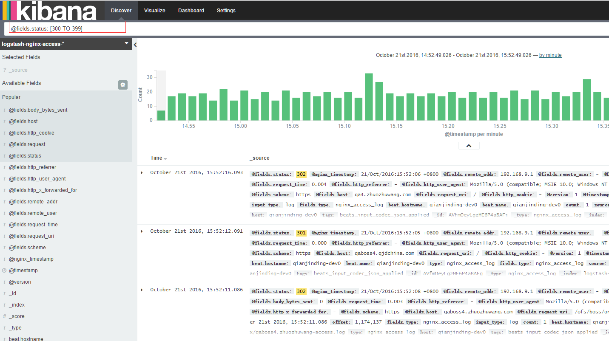

　　多个条件进行搜索：

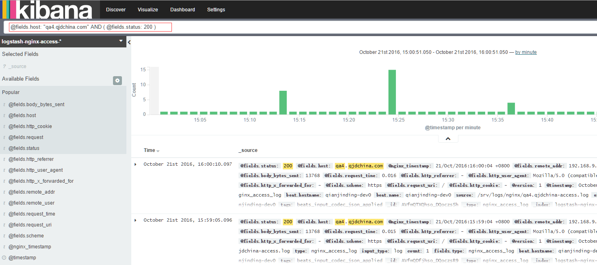

### Visualize

　　Visualize 标签页用来设计可视化。你可以保存可视化，以后再用，或者加载合并到
dashboard 里。

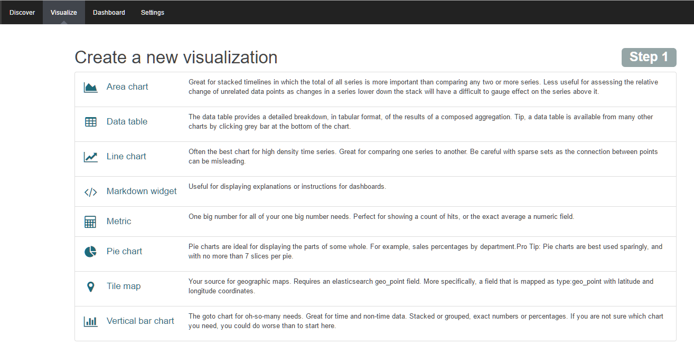

<table>
  <tr>
    <th>类型</th>
    <th>用途</th>
  </tr>
  <tr>
    <td>Area chart</td>
    <td>用区块图来可视化多个不同序列的总体贡献</td>
  </tr>
  <tr>
    <td>Data table</td>
    <td>用数据表来显示聚合的原始数据。其他可视化可以通过点击底部的方式显示数据表</td>
  </tr>
  <tr>
    <td>Line chart</td>
    <td>用折线图来比较不同序列</td>
  </tr>
  <tr>
    <td>Markdown widget</td>
    <td>用 Markdown 显示自定义格式的信息或和你仪表盘有关的用法说明</td>
  </tr>
  <tr>
    <td>Pie chart</td>
    <td>用饼图来显示每个来源对总体的贡献</td>
  </tr>
  <tr>
    <td>Tile map</td>
    <td>用地图将聚合结果和经纬度联系起来</td>
  </tr>
  <tr>
    <td>Vertical bar chart</td>
    <td>用垂直条形图作为一个通用图形</td>
  </tr>
</table>

### Dashboard 

　　用来展示visualize中添加进来的可视化图标，可以比较直观地查看到当前日志统计的一些情况

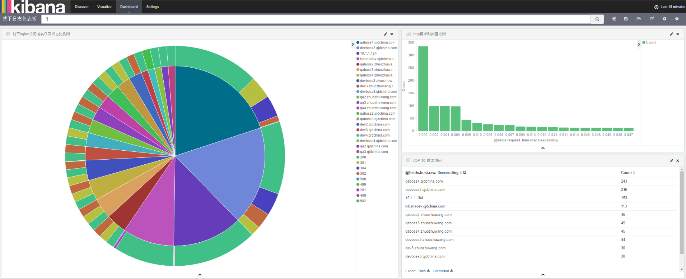

　　nginx的访问分布可以在地图上进行查看，线下kibana无法查看

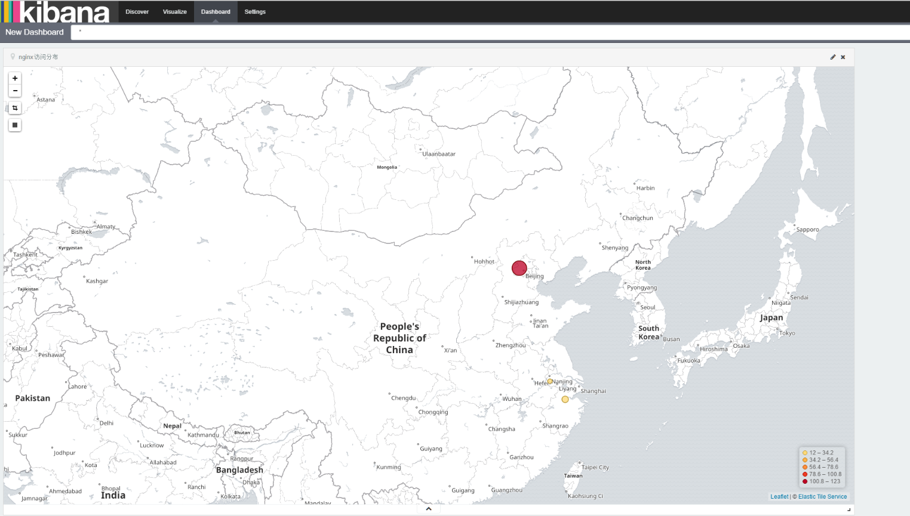

