# jumpserver 跳板机系统

------

## 环境信息

[jumpserver 跳板机系统](https://jump.htrader.cn/)，登录请使用**ldap账号密码**，如需修改密码，请访问[ldap密码自助修改页面](http://ssp.htrader.cn/index.php)。

## 功能使用

### 一、登录、连接服务器

　　登录jumpserver后，可以从用户详情看到`所有有权限连接的主机`和`登录记录`。

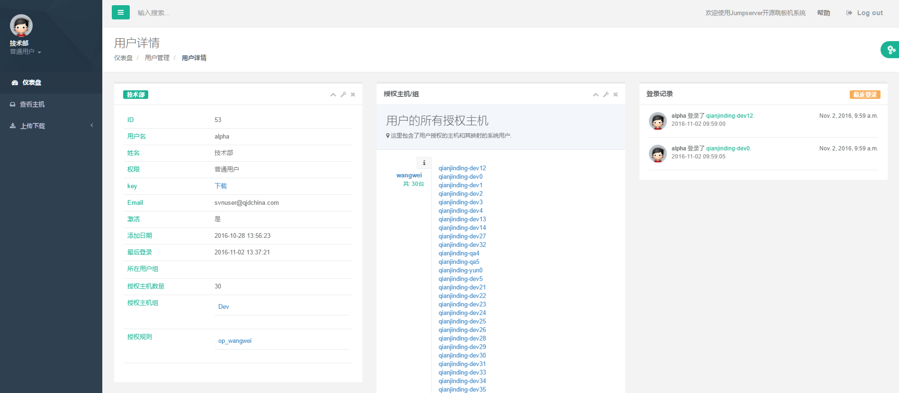

　　点击**授权主机/组**下方的任意一台主机或者点击左边菜单栏中的**查看主机**可以进入查看资产页面。

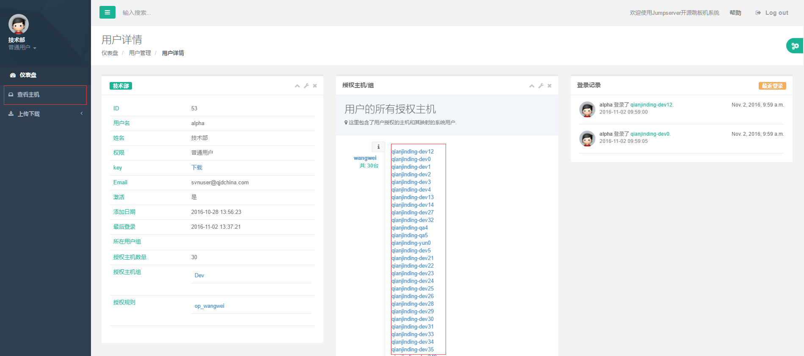

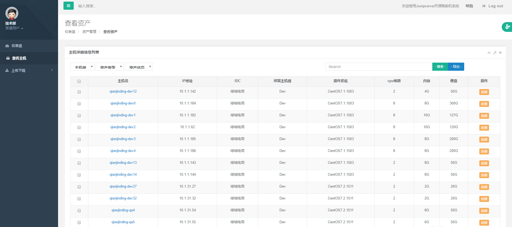

　　点击主机列表右上角的搜索可对主机进行过滤搜索，点击右边的导出可对当前有权限的主机资产列表信息进行导出，格式为excel格式。

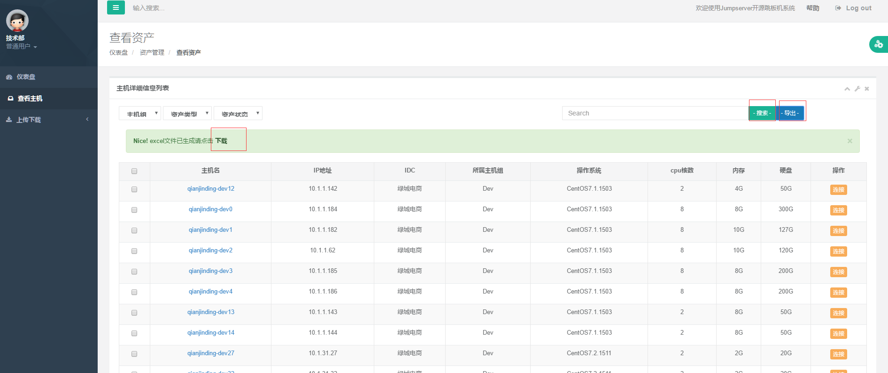

**1、通过web页面连接服务器：**

　　选择一台主机点击连接，可以连接该主机对应的终端，终端通过web界面进行显示，可在web界面上调整终端大小。

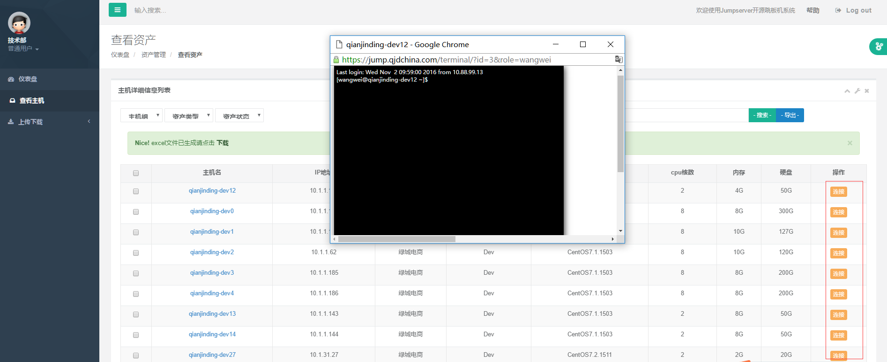

**2、通过客户端工具连接服务器：**

　　先点击左上角头像的下方，点击之后出现下图的菜单。

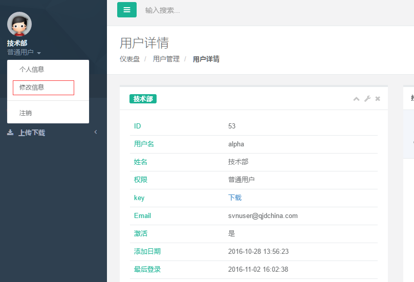

　　点击**修改信息**，进入修改个人信息界面，点击**SSH密钥重新生成** ，**私钥密码请妥善保管**，如果密码遗忘或丢失请重新进到该页面重新生成SSH密钥，保存好密码之后再点击**确定**和后面的**确认修改**按钮。注意：该界面的其它信息请不要更改，如果需要改密码请直接在登录界面点击 *Forgot password* 进行更改，或者直接点击 [ldap密码修改](http://ssp.htrader.cn/index.php) 进行修改。

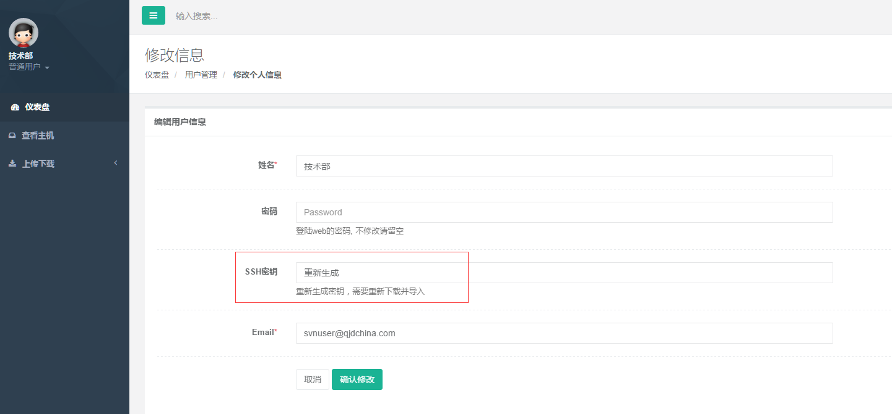

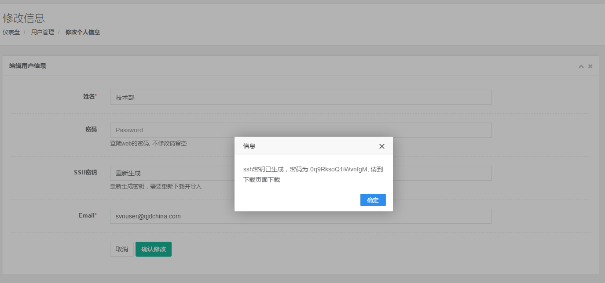

　　点击左边菜单栏的**仪表盘**进入首页，然后点击**下载**下载当前用户密钥。

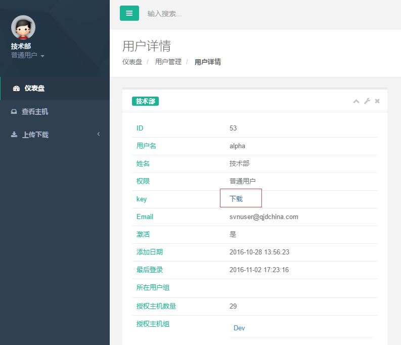

*（1）使用xshell*

　　打开xshell，新建相应会话，主机地址填写 **121.40.30.61**。

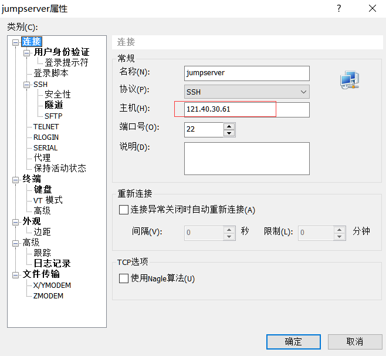

　　用户名填写自己的名字拼音，验证方式选择**Public key**，用户密钥选择前面下载的密钥，密码填下**修改信息**页面生成的SSH密码（密码和密钥是配对的，重新生成之后两者都得换）

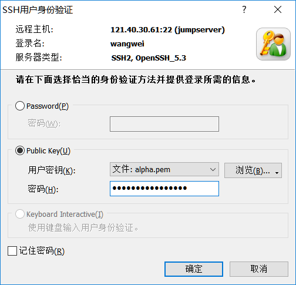

*（2）使用putty*

    putty使用的私钥key格式和已下载的私钥格式不同，**需要先进行私钥格式转换**才能登录，下载并打开puttygen。

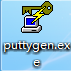

    点击`load`导入私钥：

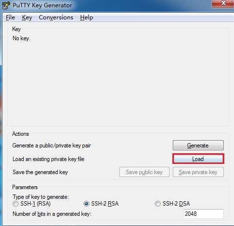

    导入私钥时候，注意选择下All File，以免看不到私钥文件。

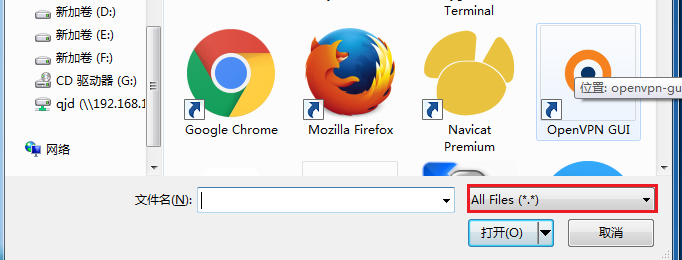

    这里输入web端生成密钥时候给出的私钥密码。

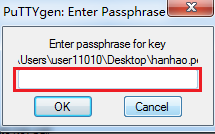

    导入成功后提示如下。

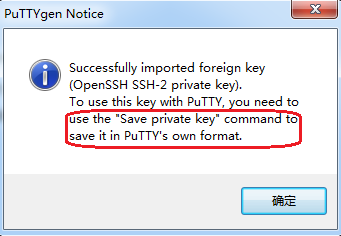

    保存私钥，你也可以同时把私钥密码一并修改掉。

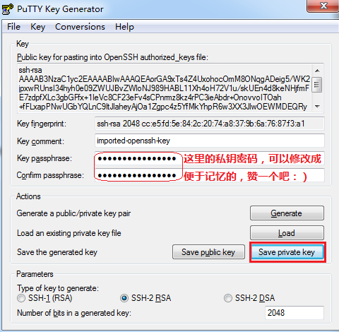

    之后的登录设置就和xshell大同小异了。你也可以查看帮助文档：[常用 SSH 客户端的设置和使用](http://wiki.htrader.cn/SSH-Clients)。

　　登录后会进入跳板机系统的管理菜单，可以根据菜单选项进行相关的操作。

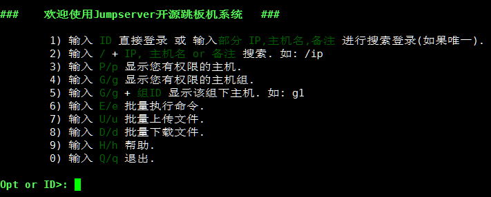

### 二、批量操作主机

　　先点击左边菜单栏的**查看主机**，然后再到主机列表中选择主机进行勾选，勾选之后选择左下角的执行命令，执行方法如下:

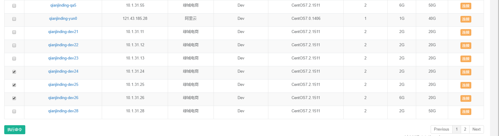

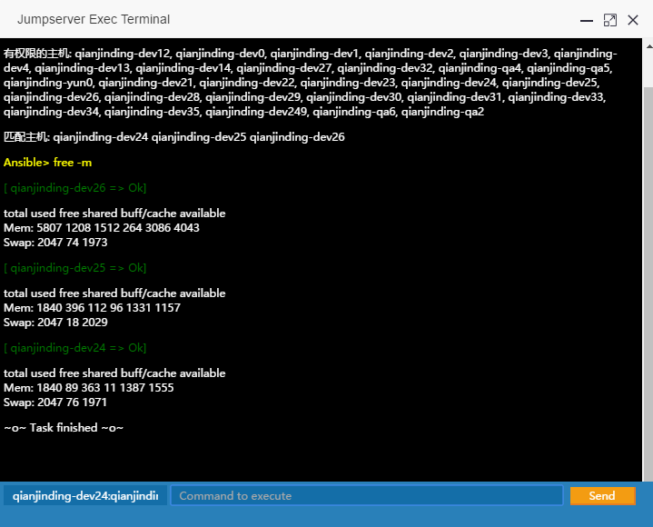

### 三、文件上传、下载

**上传文件**

　　先点击左边菜单栏的**上传下载**，然后再点击**文件上传** ，先对需要上传的主机进行选择，可选择多台主机，选择主机之后再点击下方的区域选择文件进行上传，可以上传多个文件，文件选择完毕后点击右边的**全部上传**，上传成功后会显示文件上传成功的目的目录，此时可以连接上目标主机将上传的文件拷贝到具体的某个目录

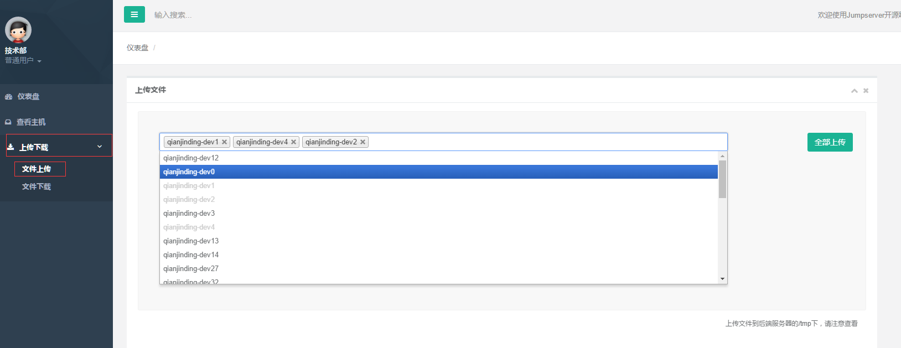

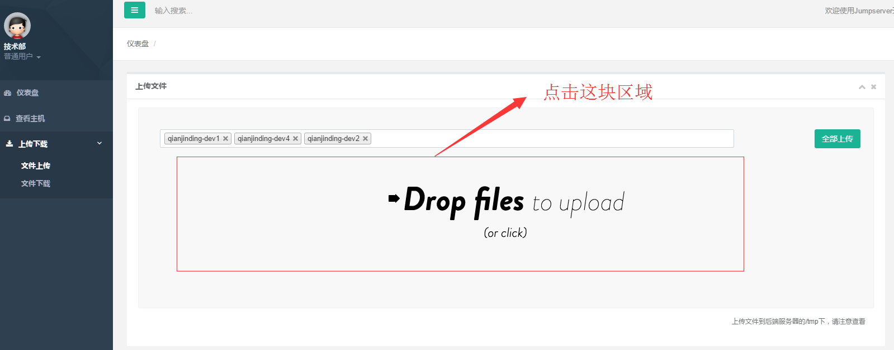

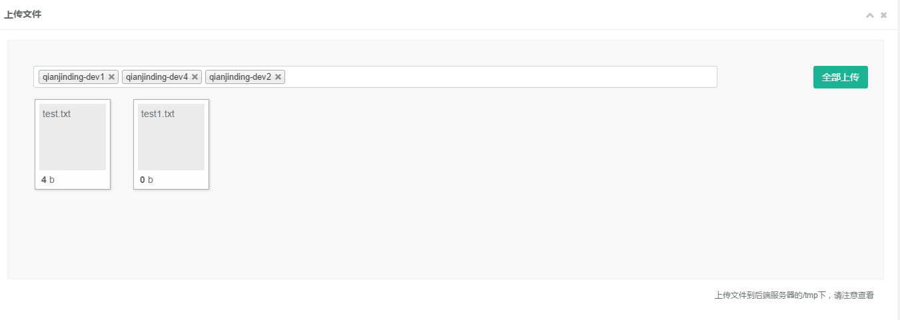

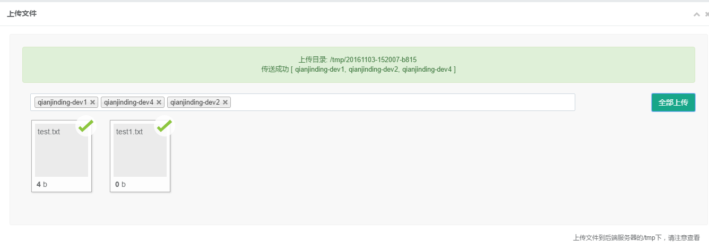

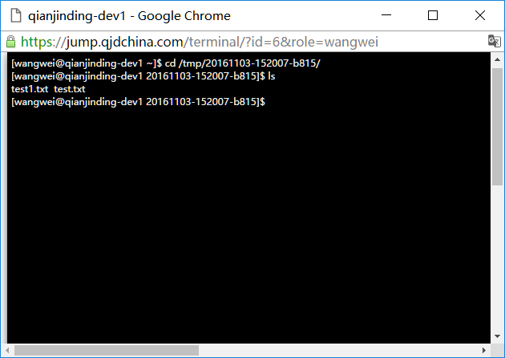

**下载文件**

　　先点击左边菜单栏的**上传下载**，然后再点击**文件下载**，文件路径请添加真实且有权限的路径，否则下载下来的压缩文件里面内容为空，下载也可以同时下载多台主机中的文件。文件下载下来后为压缩包，请解压后再将里面的文件打开

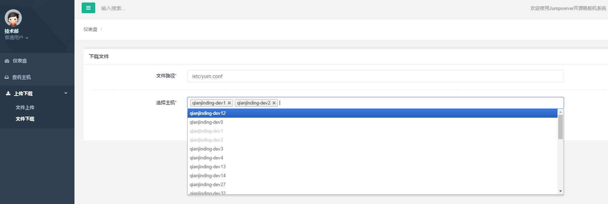

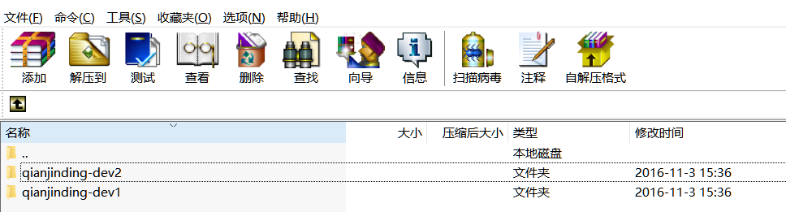
