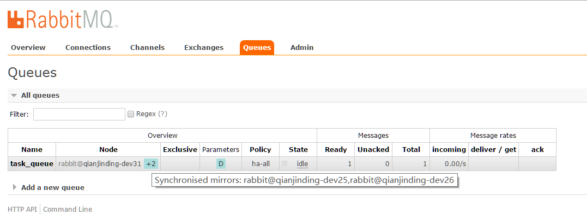
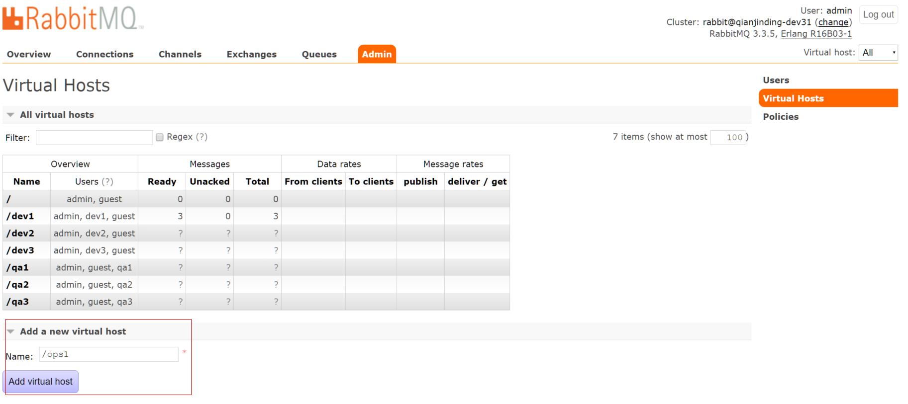
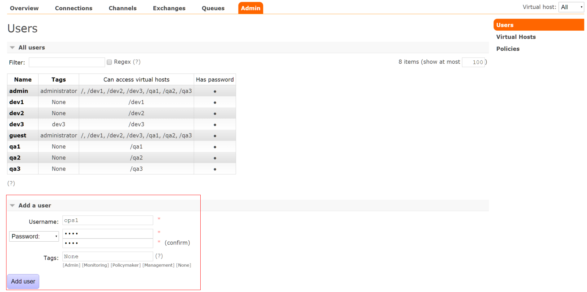
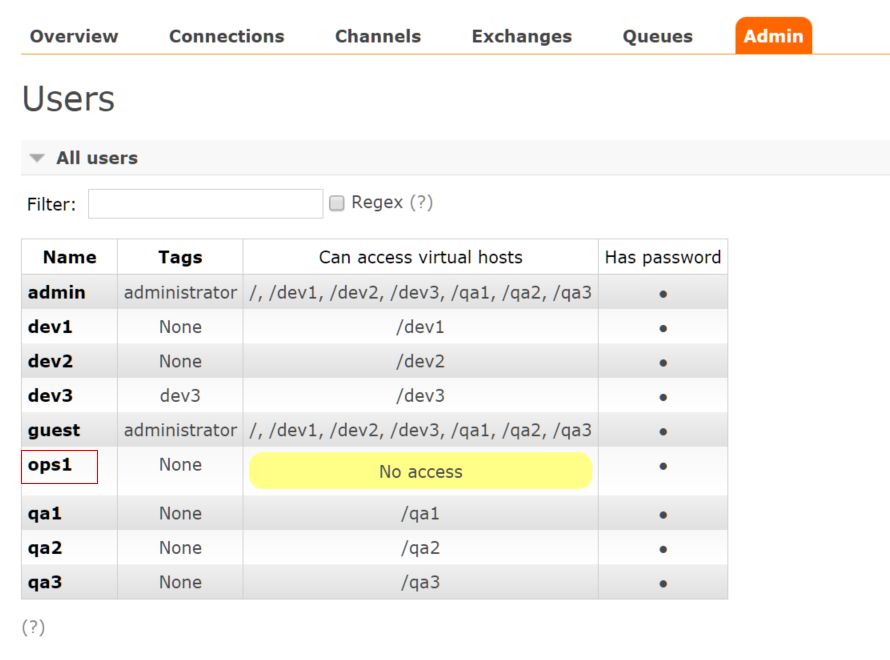
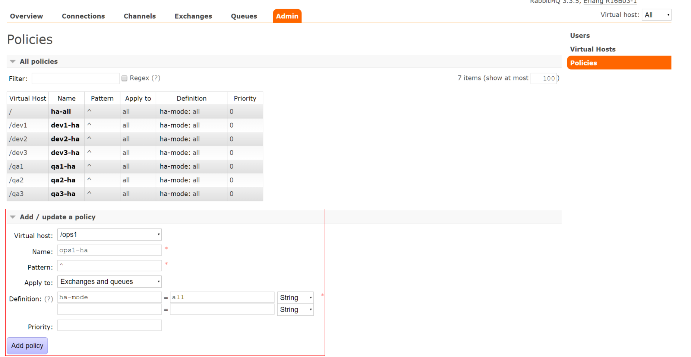
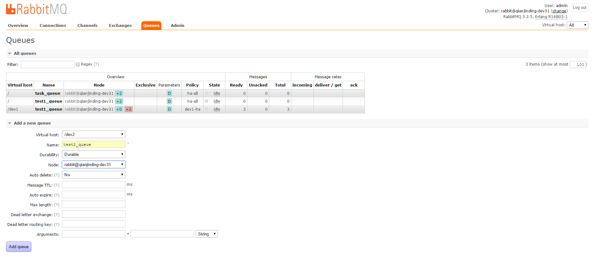

# rabbitmq

## 相关名称概念

AMQP，即Advanced Message Queuing Protocol，高级消息队列协议，是应用层协议的一个开放标准，为面向消息的中间件设计。消息中间件主要用于组件之间的解耦，消息的发送者无需知道消息使用者的存在，反之亦然。AMQP的主要特征是面向消息、队列、路由（包括点对点和发布/订阅）、可靠性、安全。

RabbitMQ是一个开源的AMQP实现，服务器端用Erlang语言编写，支持多种客户端，如：Python、Ruby、.NET、Java、JMS、C、PHP、ActionScript、XMPP、STOMP等，支持AJAX。用于在分布式系统中存储转发消息，在易用性、扩展性、高可用性等方面表现不俗。

1.  Broker：简单来说就是消息队列服务器实体。
2.  Exchange：消息交换机，它指定消息按什么规则，路由到哪个队列。
3.  Queue：消息队列载体，每个消息都会被投入到一个或多个队列。
4.  Binding：绑定，它的作用就是把exchange和queue按照路由规则绑定起来。
5.  Routing Key：路由关键字，exchange根据这个关键字进行消息投递。
6.  vhost：虚拟主机，一个broker里可以开设多个vhost，用作不同用户的权限分离。
7.  producer：消息生产者，就是投递消息的程序。
8.  consumer：消息消费者，就是接受消息的程序。
9.  channel：消息通道，在客户端的每个连接里，可建立多个channel，每个channel代表一个会话任务。

具体的概念可以参考： http://blog.csdn.net/whycold/article/details/41119807

## 消息队列大致使用过程

1.  客户端连接到消息队列服务器，打开一个channel。
2.  客户端声明一个exchange，并设置相关属性。
3.  客户端声明一个queue，并设置相关属性。
4.  客户端使用routing key，在exchange和queue之间建立好绑定关系。
5.  客户端投递消息到exchange。
6.  exchange接收到消息后，就根据消息的key和已经设置的binding，进行消息路由，将消息投递到一个或多个队列里。

## 集群模式

<b>普通模式：默认的集群模式。</b>

对于Queue来说，消息实体只存在于其中一个节点，A、B两个节点仅有相同的元数据，即队列结构。
当消息进入A节点的Queue中后，consumer从B节点拉取时，RabbitMQ会临时在A、B间进行消息传输，把A中的消息实体取出并经过B发送给consumer。
所以consumer应尽量连接每一个节点，从中取消息。即对于同一个逻辑队列，要在多个节点建立物理Queue。否则无论consumer连A或B，出口总在A，会产生瓶颈。
该模式存在一个问题就是当A节点故障后，B节点无法取到A节点中还未消费的消息实体。
如果做了消息持久化，那么得等A节点恢复，然后才可被消费；如果没有持久化的话，然后就没有然后了……

<b>镜像模式：把需要的队列做成镜像队列，存在于多个节点，属于RabbitMQ的HA方案。</b>

该模式解决了上述问题，其实质和普通模式不同之处在于，消息实体会主动在镜像节点间同步，而不是在consumer取数据时临时拉取。
该模式带来的副作用也很明显，除了降低系统性能外，如果镜像队列数量过多，加之大量的消息进入，集群内部的网络带宽将会被这种同步通讯大大消耗掉。
所以在对可靠性要求较高的场合中适用

## 集群节点

RabbitMQ的集群节点包括内存节点、磁盘节点。顾名思义内存节点就是将所有数据放在内存，磁盘节点将数据放在磁盘。不过，如果在投递消息时，打开了消息的持久化，那么即使是内存节点，数据还是安全的放在磁盘。

一个rabbitmq集 群中可以共享 user，vhost，queue，exchange等，所有的数据和状态都是必须在所有节点上复制的，一个例外是，那些当前只属于创建它的节点的消息队列，尽管它们可见且可被所有节点读取。rabbitmq节点可以动态的加入到集群中，一个节点它可以加入到集群中，也可以从集群环集群会进行一个基本的负载均衡。

集群中有两种节点： 
<b>1 内存节点：</b>只保存状态到内存（一个例外的情况是：持久的queue的持久内容将被保存到disk） 
<b>2 磁盘节点：</b>保存状态到内存和磁盘。

内存节点虽然不写入磁盘，但是它执行比磁盘节点要好。集群中，只需要一个磁盘节点来保存状态 就足够了，
如果集群中只有内存节点，那么不能停止它们，否则所有的状态，消息等都会丢失。

## 高可用集群安装部署过程

1、 准备三台主机，本次例子的三台主机为：

	qianjinding-dev25  内存节点
	qianjinding-dev26  内存节点
	qianjinding-dev31  磁盘节点

2、 安装erlang

	$ sudo yum install erlang

3、 安装rabbitmq-server

	sudo yum install rabbitmq-server

4、 安装rabbitmq web管理插件

	sudo rabbitmq-plugins enable rabbitmq_management

5、 启动rabbitmq的服务

	sudo systemctl start rabbitmq-server.service
	打开浏览器登录：http://127.0.0.1:15672 直接跳转到下列web管理登录 
	账号密码默认都是 guest 

6、 设置三个节点的cookie值

	确定可以正常访问后停止服务，sudo systemctl stop rabbitmq-server.service
	为了保证三个节点的cookie值一致，将qianjinding-dev25中 /var/lib/rabbitmq/.erlang.cookie
	中的值拷贝到其它两个节点中，其它两个节点先将.erlang.cookie文件的权限改成777，
	然后vim /var/lib/rabbitmq/.erlang.cookie，文件里面的值修改之后将权限改回400。
	改好之后都使用detached参数独立运行:   sudo rabbitmq-server -detached 

7、 加入集群节点

	qianjinding-dev25的操作
	[admin@qianjinding-dev25 rabbitmq]$ sudo rabbitmqctl stop_app
	加入内存节点的方式加入到集群中，默认不加--ram是磁盘节点的方式
	[admin@qianjinding-dev25 rabbitmq]$ sudo rabbitmqctl join_cluster --ram rabbit@qianjinding-dev31
	[admin@qianjinding-dev25 rabbitmq]$ sudo rabbitmqctl start_app
	
	qianjinding-dev26也是同样的操作
	[admin@qianjinding-dev26 rabbitmq]$ sudo rabbitmqctl stop_app
	加入内存节点的方式加入到集群中，默认不加--ram是磁盘节点的方式
	[admin@qianjinding-dev26 rabbitmq]$ sudo rabbitmqctl join_cluster --ram rabbit@qianjinding-dev31
	[admin@qianjinding-dev26 rabbitmq]$ sudo rabbitmqctl start_app

	在任意节点中执行以下操作查看集群状态
	[admin@qianjinding-dev31 rabbitmq]$ sudo rabbitmqctl cluster_status
	Cluster status of node 'rabbit@qianjinding-dev31' ...
	[{nodes,[{disc,['rabbit@qianjinding-dev31']},
	         {ram,['rabbit@qianjinding-dev26','rabbit@qianjinding-dev25']}]},
	 {running_nodes,['rabbit@qianjinding-dev25','rabbit@qianjinding-dev26',
	                 'rabbit@qianjinding-dev31']},
	 {cluster_name,<<"rabbit@qianjinding-dev31">>},
	 {partitions,[]}]
	...done.

8、 设置高可用策略

	sudo rabbitmqctl set_policy ha-all "^" '{"ha-mode":"all"}'
	策略正则表达式为 “^” 表示匹配所有队列名称。

## 测试

1、 环境

	python版本：2.7.5
	安装pip
	sudo yum install python-pip
	安装pika模块
	sudo pip install pika==0.9.8

2、 建立生产者

	## vim send.py
	#!/usr/bin/env python
	
	import pika
	import sys
	
	#如果使用特定的虚拟主机和特定的用户登录可以参考  connection = pika.BlockingConnection(pika.ConnectionParameters(host='localhost',virtual_host='/dev1',credentials=pika.credentials.PlainCredentials(username='dev1',password='dev1')))
	connection = pika.BlockingConnection(pika.ConnectionParameters(host='localhost'))
	channel = connection.channel()
	
	#durable=True 为开启持久化，可以改为False
	channel.queue_declare(queue='task_queue',durable=True)
	
	message = ' '.join(sys.argv[1:]) or 'rabbitmq test'
	channel.basic_publish(exchange='',routing_key='task_queue',body=message,properties=pika.BasicProperties(delivery_mode = 2,))
	
	print '[Procedure] Sent %r' % (message,)
	connection.close()

3、 建立消费者

	## vim receive.py
	#!/usr/bin/env python

	import pika
	import time
	
	connection = pika.BlockingConnection(pika.ConnectionParameters(host='localhost'))
	channel = connection.channel()
	
	channel.queue_declare(queue='task_queue',durable=True)
	print '[Consumer] waiting for message. To exit press CTRL+C'
	
	def callback(ch, method, properties, body):
	        print "[Consumer] received %r " % (body,)
	        time.sleep( body.count('.'))
	        print "[Consumer] Done"
	        ch.basic_ack(delivery_tag = method.delivery_tag)
	
	channel.basic_qos(prefetch_count=1)
	channel.basic_consume(callback,queue='task_queue')
	
	channel.start_consuming()

4、 简单测试
	
	执行python send.py看rabbitmq的三个节点的web页面能否看到下图的情况，
	并在另一个节点测试执行python receive.py能否去接收队列中的消息。
	模拟节点故障继续进行测试。
	

## rabbitmq管理

添加虚拟主机

添加用户，如果添加的用户为普通用户，Tags为None，如果添加的用户为管理员用户，Tags为administrator

给用户赋予相应虚拟主机的访问权限，先点击该用户名字进入用户管理的页面，然后再选择相应的虚拟主机进行授权

给虚拟主机添加策略，使所有节点都从主节点自动同步消息，其中管理员用户也得给自己赋予该虚拟主机的访问权限，然后才能去给该虚拟主机添加策略。策略中Pattern中的"^"表示匹配所有队列的名称，ha-mode的值为all表示队列会被同步到所有节点中，如果集群中新增节点，队列也会同步到该节点中

添加队列（这一步可以程序中实现）,其中Durability中的Durable为持久化的意思

如果主节点突然关机或服务异常停止，会从其它从节点中选出一个节点成为新的主节点。如果集群中有个节点由于异常无法恢复，可以先将该节点从集群中去除，前提条件为保证该节点去除后其它节点中还有disc节点存在，如果其它节点中没有disc节点了，可以先将其它某个节点改为disc节点，然后再将异常节点去除，相应的命令如下：

修改节点类型

	sudo rabbitmqctl stop_app
	sudo rabbitmqctl change_cluster_node_type disc
	sudo rabbitmqctl start_app

将节点从集群中去除

	sudo rabbitmqctl forget_cluster_node rabbit@rabbit1 

等异常节点去除后，将异常节点的rabbitmq-server的包卸载，以及删除相应的配置文件，然后再重新进行部署，操作步骤如下:

	sudo yum remove rabbitmq-server
	sudo rm -rf /etc/rabbitmq /var/lib/rabbitmq 
	sudo puppet agent -t
	
	

