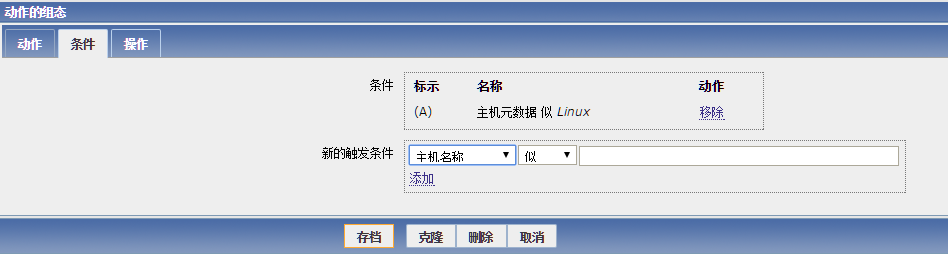
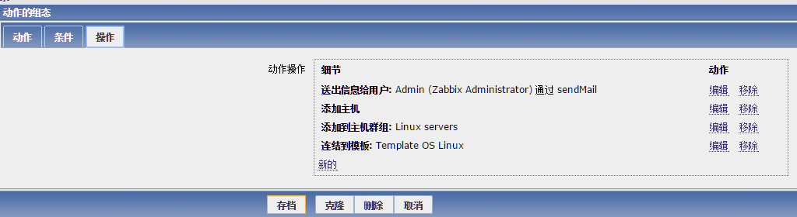
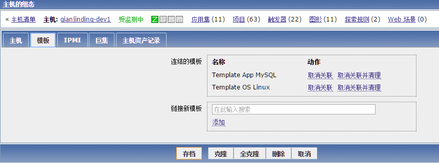
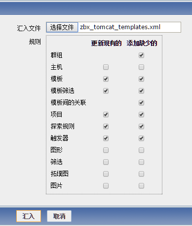

# zabbix

## 当前环境

线上地址： http://svn.htrader.cn/monitor/

线下地址： http://10.1.31.31/zabbix/

## zabbix 简介

zabbix是一个基于WEB界面的提供分布式系统监视以及网络监视功能的企业级的开源解决方案。

zabbix由zabbix server与可选组件zabbix agent两部门组成。

zabbix server可以通过SNMP，zabbix agent，ping，端口监视等方法提供对远程服务器/网络状态的监视。

zabbix agent需要安装在被监视的目标服务器上，它主要完成对硬件信息或与操作系统有关的内存，CPU等信息的收集。

----------

<b>zabbix的主要特点：</b>

- 安装与配置简单，学习成本低 
- 支持多语言（包括中文）
- 免费开源
- 自动发现服务器与网络设备
- 分布式监视以及WEB集中管理功能
- 可以无agent监视
- 用户安全认证和柔软的授权方式
- 通过WEB界面设置或查看监视结果
- email通知功能等等

----------

<b>Zabbix主要功能：</b>

- CPU负荷
- 内存使用
- 磁盘使用
- 网络状况
- 端口监视
- 日志监视 

## zabbix安装与配置

<b>服务器端源码安装：</b>

1、安装依赖包
	
	sudo yum install php-common gcc gcc-c++ autoconf httpd php mysql mysql-server php-mysql httpd-manual mod_ssl mod_perl mod_auth_mysql php-gd php-xml php-mbstring php-ldap php-pear php-xmlrpc php-bcmath mysql-connector-odbc mysql-devel libdbi-dbd-mysql net-snmp-devel curl-devel openssl openssl-devel php-mbstring php-bcmath

2、修改php.ini

	sudo vim /etc/php.ini
	# 需修改的内容如下
		max_execution_time = 300
		max_input_time = 300
		memory_limit = 128M
		post_max_size = 32M
		date.timezone = Asia/Shanghai
		mbstring.func_overload = 2

3、启动mysql和apache

	sudo system start httpd.service
	sudo system start mysqld.service

4、zabbix安装（源码包在10.1.31.31 /soft目录下)
	
	groupadd zabbix
	useradd zabbix -g zabbix
	tar xf zabbix-2.2.1.tar.gz
	cd zabbix-2.2.1
	sudo ./configure --prefix=/usr/local/zabbix --enable-server --enable-proxy --enable-agent --with-mysql=/home/environment.common/mysqldb/ --with-net-snmp --with-libcurl
	sudo make && sudo make install
	sudo vim /etc/services
	# 需修改的内容如下
		zabbix-agent  10050/tcp  #Zabbix Agent
		zabbix-agent  10050/udp  #Zabbix Agent
		zabbix-server  10051/tcp  #zabbix Trapper
		zabbix-server  10051/udp  #zabbix Trapper

5、导入数据库

	mysql -uroot -p
	create database zabbix character set utf8;
	grant all on zabbix.* to zabbix@localhost identified by 'zabbix';
	mysql -uzabbix -pzabbix zabbix<./database/mysql/schema.sql
	mysql -uzabbix -pzabbix zabbix<./database/mysql/images.sql
	mysql -uzabbix -pzabbix zabbix<./database/mysql/data.sql

6、创建链接

	sudo mkdir /var/log/zabbix
	sudo chown zabbix.zabbix /var/log/zabbix
	sudo chown zabbix.zabbix /usr/local/zabbix/etc -R
	sudo ln -s /usr/local/zabbix/etc /etc/zabbix
	sudo ln -s /usr/local/zabbix/bin/* /usr/bin/
	sudo ln -s /usr/local/zabbix/sbin/* /usr/sbin/

7、加入系统服务

	sudo cp misc/init.d/fedora/core/zabix_* /etc/init.d/
	sudo vim /etc/init.d/zabbix_server
	# 需修改的内容如下
		BASEDIR=/usr/local/zabbix

8、修改zabbix server配置文件

	DBName=zabbix
	DBUser=zabbix
	DBPassword=zabbix
	LogFile=/var/log/zabbix/zabbix_server.log

9、拷贝网页至apache目录

	cp -rf ./frontends/php/ /var/www/html/zabbix
	chown -R apache.apache /var/www/html/zabbix

10、通过浏览器访问http://x.x.x.x/zabbix根据向导安装

----------

<b>客户端yum安装：</b>

1、安装客户端
	
	sudo yum install zabbix22-agent

2、修改配置文件

	sudo vim /etc/zabbix/zabbix_agentd.conf
	# 需修改的内容如下
		PidFile=/var/run/zabbix/zabbix_agentd.pid
		LogFile=/var/log/zabbix/zabbix_agentd.log
		LogFileSize=0
		#zabbix服务器端地址
		Server=10.1.31.31
		ServerActive=10.1.31.31:10051
		#本机ip
		Hostname=qianjinding-dev0
		HostMetadataItem=system.uname
	sudo chown zabbix.zabbix /etc/zabbix -R
	sudo systemctl start zabbx-agent.service

----------

<b>web上配置客户端自动注册：</b>

1、保证客户端的配置文件内容至少包含上面zabbix_agentd.conf文件中的内容

2、配置action，配置步骤：configuration >> action >> Event source（选择Auto registration） >> Create Action

3、配置内容如下：

主机元数据包含Linux字符的主机会触发后面的操作

满足条件的active host发起请求，server会完成三个动作：

1. 把agent加到host列表
1. 把agent加入linux servers组
1. agent主机link模板Template OS linux

4、重启客户端的zabbix服务

## zabbix监控mysql

编写监控mysql的脚本
	
	sudo vim /etc/zabbix/scripts/checkmysql.sh
		#!/bin/sh

		#根据实际密码来赋值
		MYSQL_PWD=password
		ARGS=1
		
		if [ $# -ne "$ARGS" ];then
		    echo "Please input one arguement:" 
		fi
		case $1 in
		    Uptime)
		        result=`mysqladmin -uadmin -p${MYSQL_PWD} status|cut -f2 -d":"|cut -f1 -d"T"`
		            echo $result 
		            ;;
		    Com_update)
		            result=`mysqladmin -uadmin -p${MYSQL_PWD} extended-status |grep -w "Com_update"|cut -d"|" -f3`
		            echo $result 
		            ;;
		    Slow_queries)
		        result=`mysqladmin -uadmin -p${MYSQL_PWD} status |cut -f5 -d":"|cut -f1 -d"O"`
		                echo $result 
		                ;;
		    Com_select)
		        result=`mysqladmin -uadmin -p${MYSQL_PWD} extended-status |grep -w "Com_select"|cut -d"|" -f3`
		                echo $result 
		                ;;
		    Com_rollback)
		        result=`mysqladmin -uadmin -p${MYSQL_PWD} extended-status |grep -w "Com_rollback"|cut -d"|" -f3`
			            ;;
		    Questions)
		        result=`mysqladmin -uadmin -p${MYSQL_PWD} status|cut -f4 -d":"|cut -f1 -d"S"`
		                echo $result 
		                ;;
		    Com_insert)
		        result=`mysqladmin -uadmin -p${MYSQL_PWD} extended-status |grep -w "Com_insert"|cut -d"|" -f3`
		                echo $result 
		                ;;
		    Com_delete)
		        result=`mysqladmin -uadmin -p${MYSQL_PWD} extended-status |grep -w "Com_delete"|cut -d"|" -f3`
		                echo $result 
		                ;;
		    Com_commit)
		        result=`mysqladmin -uadmin -p${MYSQL_PWD} extended-status |grep -w "Com_commit"|cut -d"|" -f3`
		                echo $result 
		                ;;
		    Bytes_sent)
		        result=`mysqladmin -uadmin -p${MYSQL_PWD} extended-status |grep -w "Bytes_sent" |cut -d"|" -f3`
		                echo $result 
		                ;;
		    Bytes_received)
		        result=`mysqladmin -uadmin -p${MYSQL_PWD} extended-status |grep -w "Bytes_received" |cut -d"|" -f3` 
		                echo $result 
		                ;;
		    Com_begin)
		        result=`mysqladmin -uadmin -p${MYSQL_PWD} extended-status |grep -w "Com_begin"|cut -d"|" -f3`
	                echo $result 
	                	;;
	        *)
	        echo "Usage:$0(Uptime|Com_update|Slow_queries|Com_select|Com_rollback|Questions)" 
	        			;;
		esac

增加自定义key

	sudo vim /etc/zabbix/zabbix_agentd.conf
	#增加的内容如下
		UserParameter=mysql.version,mysql -V
		UserParameter=mysql.ping,mysqladmin -uadmin -pwestos | grep -c alive
		UserParameter=mysql.status[*],/etc/zabbix/scripts/checkmysql.sh $1 $2

服务器端进行测试

	zabbix_get -s ip -p10050 -k mysql.status[Com_select]
	zabbix_get -s ip -p10050 -k mysql.ping

重新导入配置文件，然后给相应主机添加mysql的模板,模板是zabbix系统提供的，进入zabbix web后台，configuration(组态）-->hosts（主机）-->点击你的主机name-->选择template（模板）选项卡，选择模板“Template App MySQL”，最后点击update即可

## zabbix监控nginx

编写监控nginx的脚本

	sudo vim /etc/zabbix/scripts/nginx_status.sh
		#!/bin/bash
		BKUP_DATE=`/bin/date +%Y%m%d`
		LOG="/var/log/zabbix/webstatus.log"
		HOST=127.0.0.1
		PORT="80"
		# Functions to return nginx stats
		function active {
		  /usr/bin/curl "http://$HOST:$PORT/server-status" 2>/dev/null| grep 'Active' | awk '{print $NF}'
		  }
		function reading {
		  /usr/bin/curl "http://$HOST:$PORT/server-status" 2>/dev/null| grep 'Reading' | awk '{print $2}'
		  }
		function writing {
		  /usr/bin/curl "http://$HOST:$PORT/server-status" 2>/dev/null| grep 'Writing' | awk '{print $4}'
		  }
		function waiting {
		  /usr/bin/curl "http://$HOST:$PORT/server-status" 2>/dev/null| grep 'Waiting' | awk '{print $6}'
		  }
		function accepts {
		  /usr/bin/curl "http://$HOST:$PORT/server-status" 2>/dev/null| awk NR==3 | awk '{print $1}'
		  }
		function handled {
		  /usr/bin/curl "http://$HOST:$PORT/server-status" 2>/dev/null| awk NR==3 | awk '{print $2}'
		  }
		function requests {
		  /usr/bin/curl "http://$HOST:$PORT/server-status" 2>/dev/null| awk NR==3 | awk '{print $3}'
		  }
		$1

增加自定义key

	sudo vim /etc/zabbix/zabbix_agentd.conf
	#增加的内容如下
		UserParameter=nginx.accepts,/etc/zabbix/scripts/nginx_status.sh accepts
		UserParameter=nginx.handled,/etc/zabbix/scripts/nginx_status.sh handled
		UserParameter=nginx.requests,/etc/zabbix/scripts/nginx_status.sh requests
		UserParameter=nginx.connections.active,/etc/zabbix/scripts/nginx_status.sh active
		UserParameter=nginx.connections.reading,/etc/zabbix/scripts/nginx_status.sh reading
		UserParameter=nginx.connections.writing,/etc/zabbix/scripts/nginx_status.sh writing
		UserParameter=nginx.connections.waiting,/etc/zabbix/scripts/nginx_status.sh waiting

服务器端进行测试

	zabbix_get -s ip 10050 -k "nginx.connections.active"
	zabbix_get -s ip 10050 -k "nginx.accepts"

导入nginx监控模板 nginx_template.xml （配置文件在 主机 10.1.31.31 的 /soft目录下），进入zabbix web后台，configuration（组态）-->templates（模板），然后点击右边界面的Import（汇入），将模板文件导入到zabbix系统中,然后再到相应主机添加nginx的监控模板

## zabbix监控tomcat

重新编译zabbix

	sudo ./configure --enable-java -prefix=/usr/local/zabbix  --enable-server --enable-agent --with-mysql --with-net-snmp --with-libcurl   --with-net-snmp --with-libcurl

安装jdk

	sudo yum install zabbix

修改配置文件

	sudo vim /usr/local/zabbix/sbin/zabbix_java/settings.sh
	# 需修改的内容如下
		#服务器端ip地址
		LISTEN_IP=10.1.31.31
		LISTEN_PORT=10052
		PID_FILE="/tmp/zabbix_java.pid"
		START_POLLERS=5
	sudo chown zabbix.zabbix /usr/local/zabbix -R
	sudo vim /etc/zabbix/zabbix_server.conf
	# 需添加的内容如下
		#服务器端ip地址
		JavaGateway=10.1.31.31
		JavaGatewayPort=10052
		StartJavaPollers=5

启动zabbix_java

	sudo -iu zabbix
	cd /usr/local/zabbix/sbin/zabbix_java/
	./startup.sh

传jar包到tomcat的lib目录下（jar包的路径在 10.1.31.31 的/soft目录下）

	sudo cp catalina-jmx-remote.jar /home/htrader.cn/tomcat-server/ams/lib
	sudo chown qianjinding.qianjinding /home/htrader.cn/tomcat-server/ams -R
	
修改catalina.sh

	sudo vim /home/htrader.cn/tomcat-server/ams/bin/catalina.sh
	#需添加的内容
		CATALINA_OPTS="-Dcom.sun.management.jmxremote 
               -Dcom.sun.management.jmxremote.authenticate=false 
               -Dcom.sun.management.jmxremote.ssl=false
               -Dcom.sun.management.jmxremote.port=12345"

然后重启tomcat和zabbix客户端的服务，重启之后到服务器端进行测试

	java -jar /root/cmdline-jmxclient-0.10.3.jar  - 10.1.1.144:12345 java.lang:type=Memory NonHeapMemoryUsage

返回结果如下所示
	
	22/07/2016 15:42:02 +0800 org.archive.jmx.Client NonHeapMemoryUsage: 
	committed: 47316992
	init: 24313856
	max: 136314880
	used: 47012784

选择相应的host添加模板，如果需要监控堆内存状态和类状态等信息可以添加自定义模板，自定义模板文件名为zbx_tomcat_templates.xml（文件在10.1.31.31的/soft目录下），导入过程中可能会报错，导入的时候取消图形的选择， 然后再到模板里面手动添加图形

	
