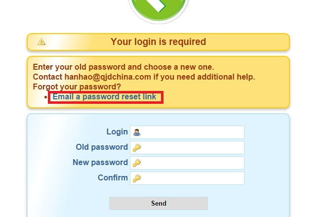
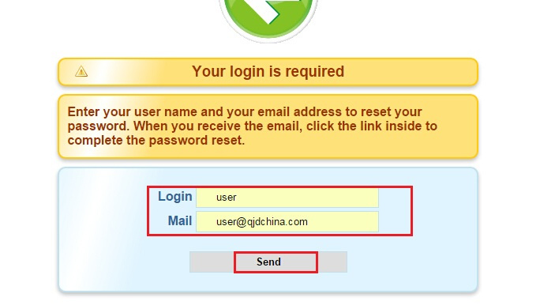
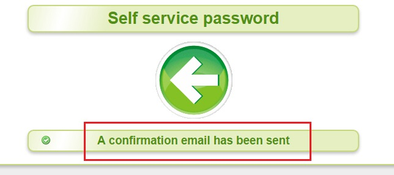
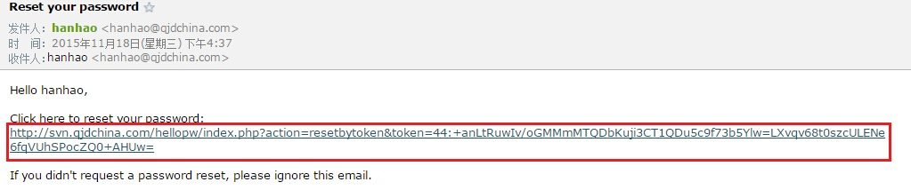
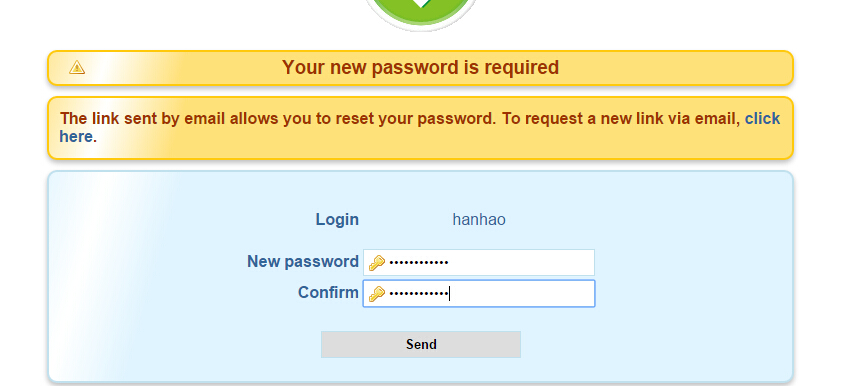
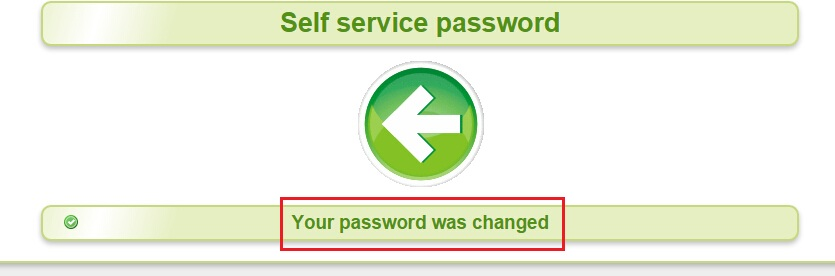

# 重置LDAP账号的密码

## 更新

> 2015/12/16 中文汉化

## 使用方法

通常用于忘记密码或重置初始密码。

## 密码修改

1、点击`Email a password reset link`，重置密码。

  

2、填写`用户名`和`邮件`，例如用户名为`user`，对应的仟金顶工作邮箱为`user@htrader.cn`。然后点击`Send`提交。

> 注意：存在这样一种情况，当A用户离职，由B用户暂时接管A用户账号时，则此处用户名为A，邮箱则为B@htrader.cn。

  

3、等待一会，界面会提示`A confirmation email has been sent`，说明重置密码的邮件已经发送成功。

  

4、在自己的工作邮箱中收取重置密码的链接地址，并在浏览器中打开、访问。

  

5、在`New password`和`Confim`中输入新的密码。注意，密码应包含英文字母和数字，且有一定长度。不符合要求的密码会有提示信息。

  

6、等待一会，密码修改成功！出现“Your password was changed”提示，你的邮箱中也会收到一封提醒邮件。

  
