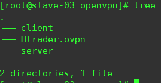
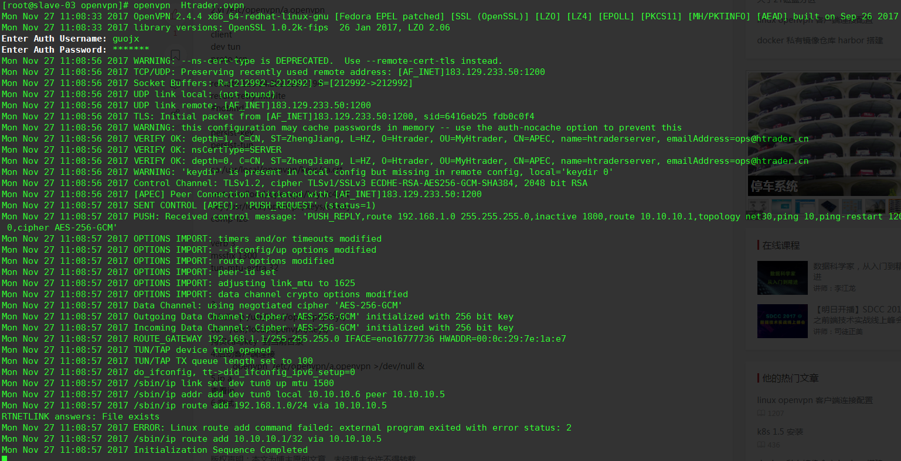
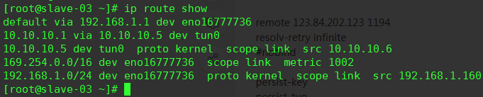

## Linux版openvpn客户端使用方法

### yum安装epel源

yum install epel-release -y

### yum安装openvpn

yum install openvpn -y

### 下载Linux版 [配置文件](software/Htrader.ovpn)

cd /etc/openvpn/

wget http://wiki.htrader.cn/openvpn/software/Htrader.ovpn

  

### 启动客户端, 输入LDAP用户名密码

openvpn  /etc/openvpn/Htrader.ovpn

  

### 查看路由验证

ip route show 或 route -n

  
