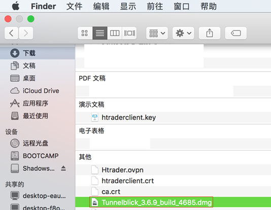
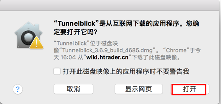
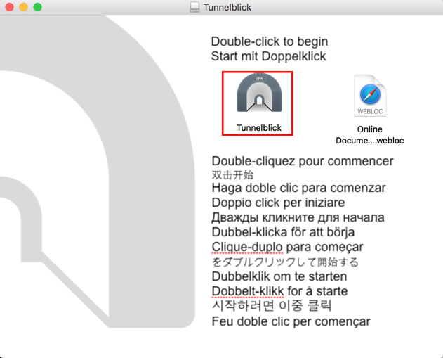
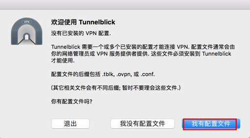
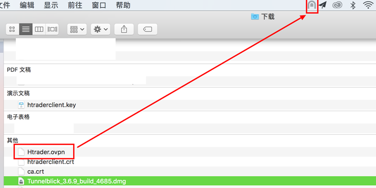
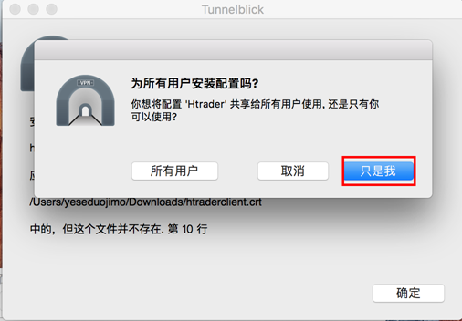
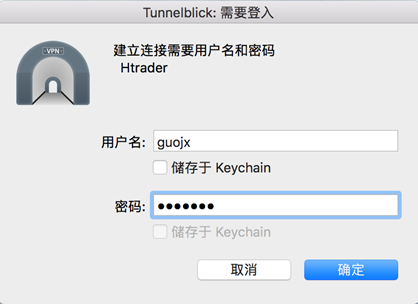
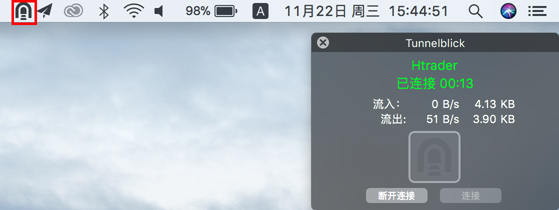
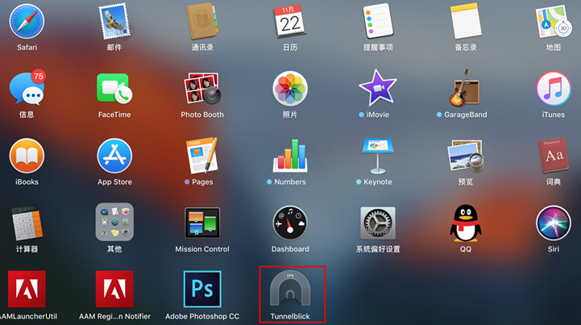

## Mac版openvpn客户端使用方法

### 1. 下载Mac版 [openvpn客户端](software/Tunnelblick_3.6.9_build_4685.dmg)、[CA](software/ca.crt)、[htraderclient.crt](software/htraderclient.crt)、[htraderclient.key](software/htraderclient.key)和 [配置文件](software/Htrader.ovpn)

  

### 2. 双击程序包安装, 跳出窗口点击打开, 跳出Tunnelblick窗口, 双击Tunnelblick图标

  
  
  
### 3. 安装完成, 跳出窗口, 选择 “我有配置文件”

  
  
### 4. 将配置文件 Htrader.ovpn 拖到TunnelBlick图标上

  
  
### 5. 在弹出的窗口中, 点击 “只是我”

  
  
### 6. 在Tunnelblick图标的下拉列表中点击连接, 输入LDAP的用户名密码

  
  
### 7. OK, 连接成功, 现在可以访问公司内网了
  
    
  