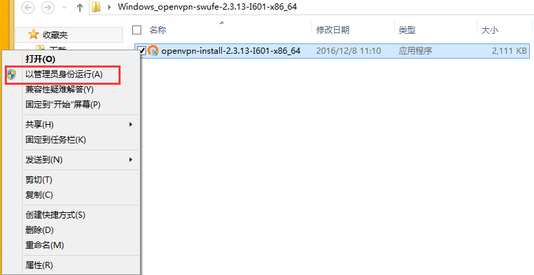
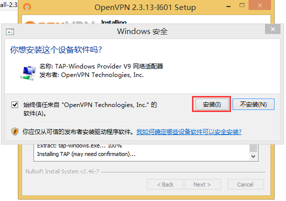
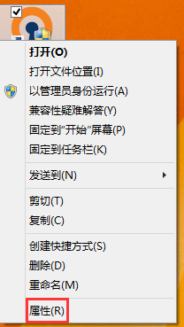
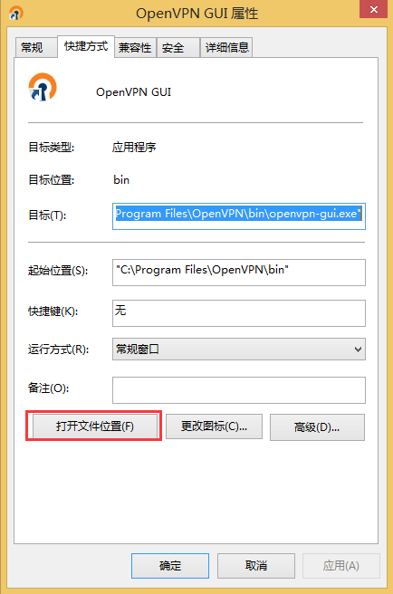
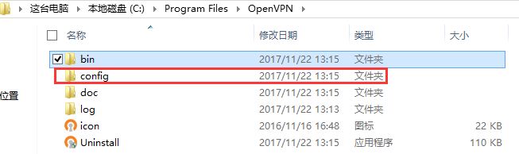
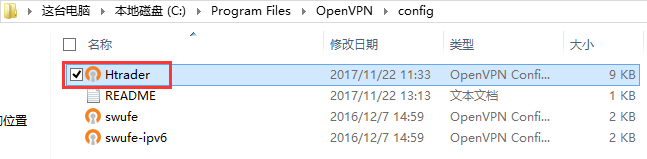
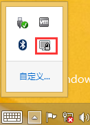
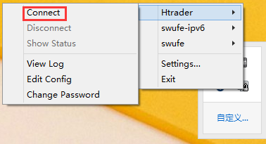
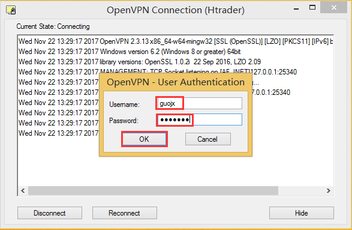
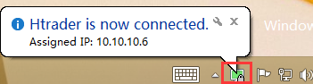

## Windows版OpenVPN客户端使用方法

### 1. 下载Windows版 [openvpn客户端](software/Windows_openvpn-swufe-2.3.13-I601-x86_64.zip) 、[配置文件](software/Htrader.ovpn), 解压以管理员身份运行

  

### 2. 一直下一步完成安装, 安装最后一步跳出Windows安全, 选择安装

  
  
### 3. 安装完毕, 桌面生成图标OpenVPN GUI

  
  
### 4. 在该图标上右键属性, 打开文件位置

  
  
### 5. 进入其上级目录中的config文件夹

  
  
### 6. 将下载好的Htrader.owindows文件放置在该目录

  
  
### 7. OK, 配置已完成, 现在以管理员身份运行openvpn GUI, 任务栏里会出现如下图标
  
  
  
### 8. 右键该图标, 选Htrader --> Connect
  
  
  
### 9. 输入LDAP用户名密码
  
  
  
### 10. 图标变绿, 连接成功, OK, 现在可以访问公司内网了
  
  